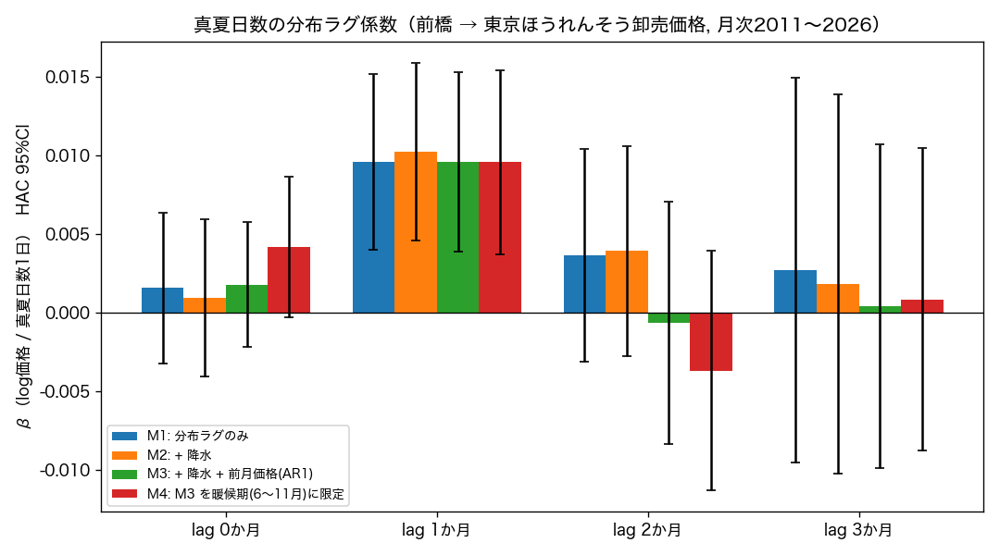

# CS-07 スパイク — 産地の気象 → 数週後の葉物卸売価格

**[← experiments](../README.md)** ・ 対象: [ID-25](../../docs/idea_catalog.md) / [CS-07](../../docs/correlation_studies.md)
経過: ① 日照のみ → NO-GO ／ ② 気象を4特徴に拡張 → ほうれんそう×真夏日数が浮上 ／ ③ その1本を15年月次で検証 → 支持 ／ ④ **分布ラグ回帰で交絡統制 → 前橋の真夏日数(月t) → 東京ほうれんそう卸売価格(月t+1) の効果が確定**（レタスは②で終了）

## 結論（2026-09-02）
**「前橋で真夏日（最高気温≥30℃）が平年より1日多い月の翌月、東京のほうれんそう卸売価格が約 +1% 高い」——この先行効果は、季節・トレンド・前月価格(AR1)・降水を同時に統制した分布ラグ回帰でも t≈+3.3（p≈0.001）で残る。**
- 効果は**ラグ1か月にほぼ集中**（ラグ0・2・3は 0 近傍）。ほうれんそうの生育期間（30〜40日）＋出荷サイクルと符合。
- 真夏日+10日 → 翌月 +約10%（M3, 前月価格まで入れた仕様）。真夏日数ブロックの同時 Wald 検定は全モデルで p<0.001。
- ただし**予測 R² の上乗せは小さい**（前月価格＋暦月ダミーで adj.R²≈0.71、真夏日数を足しても +0.003）。前月価格が既に暑さの結果を含むため。→ 「AR モデルへの追加特徴」としては限界的、「価格が動く前の早期警戒シグナル」としては有効。
- 「気象単独で価格を"当てる"」のは依然無理（相関 r²≲0.2）。だが **ID-25 の中核仮説（産地の気象ストレスが数週〜1か月先行して価格を動かす）は、ほうれんそう×高温について確認された。**

| 段階 | 手法 | 主結果 |
|---|---|---|
| ③ 相関（本命データ） | 月次15年 n=186、循環置換検定 | ラグ1か月 Spearman ρ=+0.34（暖候期 +0.43, r²≈0.18）、p<0.001 |
| **④ 分布ラグ回帰** | log価格 ~ trend + 暦月 + Σhot_anom_Lk + precip + logp_L1、HAC(NW) | **hot_anom_L1 β=+0.0096, HAC t=+3.3, p=0.001**（M1〜M4で安定）。同時検定 p<0.001 |
| ② 週次（短期・参考） | ベジ探 日別 2024〜 n=136 | ラグ3週 ρ=+0.16（p=0.06）— 同符号だが期間2.7年で検出力不足 |

> 副産物: 気象庁 etrn（p1+a3, 2011〜）＋ベジ探 sch7.do（日別／月別 `--monthly`）の**完全自動取得**コード。回帰は `regress_spinach_hotdays.py`（statsmodels）。

## データ（[CLAUDE.md](../../CLAUDE.md) のルール順守）
| | 取得元 | スクリプト | Python |
|---|---|---|---|
| 気象（日別・降水/最高気温/日照/全天日射） | 気象庁「過去の気象データ検索」 daily_s1.php（view=p1 と a3） | `fetch_jma_daily.py` | ◎ 公開・鍵不要・完全自動 |
| 卸売価格（東京・日別） | ベジ探「卸売市場別入荷量・価格」 sch7.do | `fetch_veg_price.py` | ◎ 鍵不要・完全自動（1リクエスト=1か月） |
| 卸売価格（東京・月次 2011〜） | ベジ探「卸売市場別入荷量・価格」 sch7.do（月別 outPutKbn=1） | `fetch_veg_price.py --monthly` | ◎ 鍵不要・完全自動（1リクエスト=1年） |
| 特徴×ラグの相関＋ヒートマップ（②） | — | `analyze_lag_corr.py` | `results/lag_corr_<品目>.png`, `summary_<品目>.txt` |
| **単一仮説の検証（③・本命）** | — | `analyze_spinach_hotdays.py` | `results/spinach_hotdays.png`, `spinach_hotdays.txt` |
| 日照ディープダイブ（6パネル・①） | — | `plot_diagnostics.py` | `results/diagnostics_<品目>.png`（日照のみ） |

**手動DL不要**。生データは `data/cs07/`（`.gitignore` 済み）。図と集計は `results/`（Git 追跡）。
全天日射量の観測は官署が限られる（長野・前橋・静岡・東京にはあり、諏訪・熊谷には無い）。`config.JMA_STATIONS` の `[日射]` 印を参照。

## 手順
```bash
cd experiments/cs07_veg_price
P=/opt/anaconda3/envs/met_env/bin/python

$P fetch_jma_daily.py maebashi          # 前橋の日別4要素 2011〜2026（p1+a3）約15分
$P fetch_veg_price.py                   # ベジ探 日別 卸売価格 2024〜（週次確認用）
$P fetch_veg_price.py --monthly         # ベジ探 月別 卸売価格 2011〜2026（③の本命データ）
$P analyze_spinach_hotdays.py           # ③ 単一仮説＋交絡/しきい値の頑健性 → results/spinach_hotdays.{png,txt}
$P regress_spinach_hotdays.py           # ④ 分布ラグ回帰(HAC) → results/spinach_hotdays_regression.{png,txt}
# 参考: $P analyze_lag_corr.py（②の探索）, $P plot_diagnostics.py（①の日照6パネル）
```

## ④ 分布ラグ回帰 — 交絡を統制しても効果は残るか（本命）
`regress_spinach_hotdays.py`（statsmodels, Newey-West HAC）。③の相関が、季節（暦月ダミー）・線形トレンド・**前月価格(AR1)**・降水 を同時に入れても残るかを確認。

`log(price_t) ~ trend + C(month) + Σ_k β_k·真夏日数偏差_{t−k} (+ 降水偏差, + log価格_{t−1})`



| モデル | hot_anom_L1 の β | HAC t | p | 同時検定 p | adj.R² | n |
|---|---|---|---|---|---|---|
| M1 分布ラグのみ | +0.0096 | +3.37 | 0.0008 | 0.0002 | 0.647 | 184 |
| M2 ＋降水 | +0.0103 | +3.57 | 0.0004 | 0.0002 | 0.647 | 184 |
| M3 ＋降水＋前月価格(AR1) | +0.0096 | +3.30 | 0.0010 | <0.0001 | 0.708 | 184 |
| M4 M3を暖候期6〜11月に限定 | +0.0096 | +3.20 | 0.0014 | 0.0001 | 0.739 | 92 |

- **ラグ1か月の係数が全モデルで β≈+0.0096〜0.0103・t>3・p≈0.001 と安定**。季節・トレンド・AR1・降水を入れても消えない。効果は**ラグ1か月にほぼ集中**（L0・L2・L3 は 95%CI が 0 をまたぐ）。
- 大きさ: 真夏日 +1日 → 翌月 +約1%。**+10日 → 翌月 +約10%**（M3）。真夏日数ブロックの Wald 同時検定は p<0.001。
- ただし **adj.R² の上乗せは +0.003**（前月価格＋暦月ダミーで既に 0.706）。前月価格がすでに前月の暑さの結果を含むため、AR モデルへの"予測特徴"としての追加価値は限界的。**「価格が動く前に出るシグナル」としては有効。**

## ③ 単一仮説の検証（相関・15年月次）— ほうれんそう × 真夏日数
`analyze_spinach_hotdays.py`。②の探索で最大効果量だった1組を**事前登録**し、期間を月次15年に伸ばし、多重比較を排し、自己相関に頑健な**循環シフト置換検定**で確認。


| 検証 | ラグ | ρ | p（通常 / 循環置換） | 95%CI | r² |
|---|---|---|---|---|---|
| 月次 2011〜2026 (n=186) | 1か月 | **+0.336** | <0.001 / <0.001 | [+0.20,+0.46] | 0.113 |
| 月次 2011〜2026 (n=185) | 2か月 | +0.240 | 0.001 / 0.007 | [+0.10,+0.37] | 0.057 |
| 月次 **6〜10月のみ** (n=76) | 1か月 | **+0.427** | <0.001 / <0.001 | [+0.22,+0.59] | **0.182** |
| 週次 2024〜 (n=136) | 3週 | +0.161 | 0.061 / 0.096 | [−0.01,+0.32] | 0.026 |

- **月次は明確に H1 支持**（真夏日数偏差 大 → 1〜2か月後に価格残差 大）。効果量は暖候期で r²≈0.18＝中程度。
- 週次（2.7年）は同符号だが検出力不足で非有意。サブ月スケールのラグは短期データでは決まらない。
- 循環置換検定＝月次の強い自己相関（暑い夏は連続する等）を保ったまま帰無分布を作る。通常の p とほぼ一致 → 見かけの相関ではない。

### 季節・トレンド交絡のチェック（lag1か月・全月）
「夏＝暑い＆夏＝高値」を拾っているだけでは？ という懸念への確認。元の分析は既に**暦月平均を差し引いて**あるので "夏 vs 冬" ではなく**同じ暦月の年々偏差**を見ているが、さらにトレンドも潰す。

| 前処理 | ρ | p |
|---|---|---|
| 月中心化のみ（元） | +0.336 | <0.001 |
| ＋ 線形トレンド除去 | +0.311 | <0.001 |
| **前年同月比 YoY（季節・トレンド完全除去）** | **+0.338** | **<0.001** |

トレンド自体が小さく（真夏日数 +0.14日/年、log価格 +1%/年）、除いても ρ はほぼ不変。前年同月比（今年8月 vs 去年8月）でも同じ。ラグ0(ρ=0.15) < ラグ1(ρ=0.34) とピークが翌月にある点も、共通トレンドの見かけ相関を否定する。→ **季節要因ではなく年々変動の実シグナル。**

### 「30℃」を選んだ蓋然性（しきい値・指標の頑健性）
②で 25℃ と 30℃ を試して 30℃ が最強だったので、しきい値の探し当て（fishing）の懸念がある。しきい値と暑さ指標を広く振って確認（暖候期・lag1か月）:

| 指標 | ρ |
|---|---|
| tmax≥24℃ 日数 | +0.21 |
| tmax≥25℃ 日数 | +0.29 |
| tmax≥26℃ 日数 | +0.30 |
| tmax≥28℃ 日数 | +0.40 |
| **tmax≥30℃ 日数（真夏日）** | **+0.46** |
| tmax≥32℃ 日数 | +0.47 |
| tmax≥34℃ 日数 | +0.47 |
| tmax≥35℃ 日数（猛暑日） | +0.37 |
| 月平均 最高気温 | +0.46 |
| 25℃/30℃ 超過度日 | +0.46 / +0.47 |

**24〜34℃ のどのしきい値でも、どの暑さ指標でも ρ≈0.3〜0.47。** 30℃で尖っているわけではなく、24〜25℃で立ち上がり28〜34℃で頭打ちになる**なだらかな尾根**。真夏日（≥30℃）は気象庁の標準区分でもあり、恣意的な数値ではない。「暑さ」全般のシグナルであって、特定の閾値の産物ではない。

### ほうれんそう × 高温の園芸学的根拠
- ほうれんそうは**冷涼性作物**。生育適温 10〜20℃、**25℃以上で生育停止**、暑さに極めて弱い（[タキイ種苗 栽培マニュアル](https://www.takii.co.jp/tsk/manual/hourensou.html)）。
- 発芽適温 15〜20℃、**25℃超で発芽が悪化、30℃以上で発芽率が極端に低下**（[JA新みやぎ ほうれん草栽培マニュアル](https://www.pref.miyagi.jp/documents/45159/horenso-manual.pdf) 他）。英語文献でも「>20℃で発芽阻害が始まり 35℃で完全抑制」「25℃超で発芽率・速度・斉一性が低下」（[Effect of Temperature on Seed Germination in Spinach](https://www.researchgate.net/publication/312048125_Effect_of_Temperature_on_Seed_Germination_in_Spinach_Spinacia_oleracea)）。
- **抽苔（とう立ち）**は花芽分化（発芽後15〜30日）＋高温・長日で促進。夏まきは雨よけ＋遮光が必須でコスト・リスク大。
- **統計と生理が一致**: ρ が立ち上がる 24〜25℃ ＝「生育停止」ライン、最強の 28〜32℃ ＝「発芽激減」帯。ラグ1〜2か月 ＝ 発芽不良・生育不良・抽苔（月t）→ 収穫減（約30〜40日後）→ 価格上昇、という機構と符合。

**残る留保**: ②で 30℃ を「最強セル」として選び、③でも同じ 30℃ を使った点で選択は完全には消えていない。ただし (a) 25℃でも有意（暖候期 ρ=+0.29, p=0.011）、(b) なだらかな尾根で単一の当たりくじではない、(c) 機構は教科書どおり、の3点で fishing の懸念は小さい。

## ② 気象特徴 × ラグの探索（2026-09-02）
`analyze_lag_corr.py`。各セル = 週次の「week-of-year 標準化偏差」と、季節調整 log 価格残差（tラグ週後）の Spearman ρ。`*` は p<0.05（多重比較 未補正）。

### レタス / 長野（140週）


- **日照時間**: lag2〜4 が負（lag3 −0.19*, lag4 −0.19*）。当初仮説「日照不足→数週後に高値」と一致。
- **全天日射量**: lag2〜4 が負（lag3 −0.16）。日照と同方向で整合。
- **降水量**: lag2〜5 が正（lag4 +0.17*）。多雨→数週後に高値（病害・生育不良）。
- **高温日数（≥25/30℃）**: lag0 が正（夏日数 +0.28*, 真夏日数 +0.24）。暑い週は"その週"の価格が高い（レタスは高温に弱い）。
- 4チャネルとも「気象ストレス→供給減→高値」で符号が生理的に一貫。ただし \|ρ\|≤0.28。

### ほうれんそう / 前橋（140週）


- **真夏日数（≥30℃）**: **lag3 で ρ=+0.32*（p=0.008, r²≈0.10, n=68）**。本スパイクで最大の効果量。ラグ3週＝生育期間と符合。
- **全天日射量**: lag1 +0.23*（p=0.007）。**日照**: lag1 +0.18*。短ラグの正＝日射・日照が多い週の約1週後に高値。
- **降水量**: lag1 −0.15（p=0.09）。雨で暑さが和らぐ効果か（弱い）。
- レタスと符号が逆（日照・日射・高温いずれも "多い→高値"）＝ほうれんそうは暑さ・強光ストレスに弱い、で一貫。

## ① 日照のみの診断図（`results/diagnostics_<品目>.png`）
日照時間だけを深掘りした6パネル（CCF / 散布図 / 5分位 / 夏季限定 / ローリング相関 / 週次系列）。読み方は各パネル題のとおり。
※ ②の拡張前に作ったもの。レタスは産地を諏訪→長野に変えたため数値が①の結果ログと少し違う。

**レタス** 
**ほうれんそう** 

## 判定基準（σ・p・効果量）
| 基準 | しきい値 | 意味 |
|---|---|---|
| p 値（Spearman, 両側） | < 0.05 で名目有意。ただし 45セル見ているので **×45 で補正**して評価 | 相関が偶然でないと言える最低ライン |
| z = ρ / SE | 有意 1.96σ / "証拠"級 3σ（SE ≈ 1/√(n−1)） | 0 から何σ離れているか |
| 効果量 \|ρ\| | <0.1 無視 / 0.1–0.3 弱 / 0.3–0.5 中 / >0.5 強 | 実務なら \|ρ\|≳0.3（r²≳0.1）が欲しい |
| 事前 GO 条件 | 日照 ラグ2-4週で p<0.05 かつ ρ<0 | 当初登録した唯一の一次仮説 |

## 結果ログ
| 日付 | 段階 | 品目 / 産地 | データ | 主要な所見 | 判定 |
|---|---|---|---|---|---|
| 2026-09-02 | ① 日照のみ | レタス / 諏訪 | 週次139 | 日照 lag3 ρ=−0.159 (p=0.064)。符号は仮説どおりだが非有意 | NO-GO |
| 2026-09-02 | ① 日照のみ | ほうれんそう / 前橋 | 週次139 | 日照 lag1 ρ=+0.178 (p=0.036)。符号が逆・多重比較で非有意 | NO-GO |
| 2026-09-02 | ② 4特徴探索 | レタス / 長野 | 週次140 | 日照 lag3-4 ρ=−0.19、日射・降水も同方向。45セルの多重比較で×。r²≤0.08 → **レタスはここで終了** | 打ち切り |
| 2026-09-02 | ② 4特徴探索 | ほうれんそう / 前橋 | 週次140 | 真夏日数 lag3 ρ=+0.32 (p=0.008)。45セル中で最大効果量 → ③へ | 有望 |
| 2026-09-02 | ③ 単一仮説（相関） | ほうれんそう / 前橋 | 月次186（2011〜） | 真夏日数偏差 → +1か月 ρ=+0.336（暖候期 +0.427, r²≈0.18）、循環置換 p<0.001。しきい値24〜34℃で頑健、季節・トレンド除去でも不変 | H1 支持 |
| 2026-09-02 | **④ 分布ラグ回帰** | **ほうれんそう / 前橋** | 月次184（2011〜） | **hot_anom_L1 β=+0.0096, HAC t=+3.3, p=0.001**（季節・トレンド・AR1・降水を統制、M1〜M4で安定）。真夏日+10日→翌月+約10%。adj.R²上乗せは+0.003 | **効果確定** |

## 次にやること
1. **産地の合成**: 前橋だけでなく 熊谷・宇都宮・水戸（＋冬は宮崎・福岡）の真夏日数を東京入荷ウェイトで合成し、係数と安定性が上がるか。
2. **日次で埋める**: 2023年以前の日別価格を e-Stat「青果物卸売市場調査（日別調査）」から足し、週次でもラグ2〜4週の効果が立つか（月次より実用に近い早期警戒になる）。
3. 他の暑さ指標（WBGT・熱帯夜＝夜間最低気温≥25℃・生育期の積算高温）で効果量が上がるか。
4. 品目拡張: こまつな等の葉物（`config.CROPS` に追加）。
5. デモ化: 「今夏の前橋の真夏日ペース → 来月のほうれんそう卸売価格の見通し＋生成AIの一言」。
