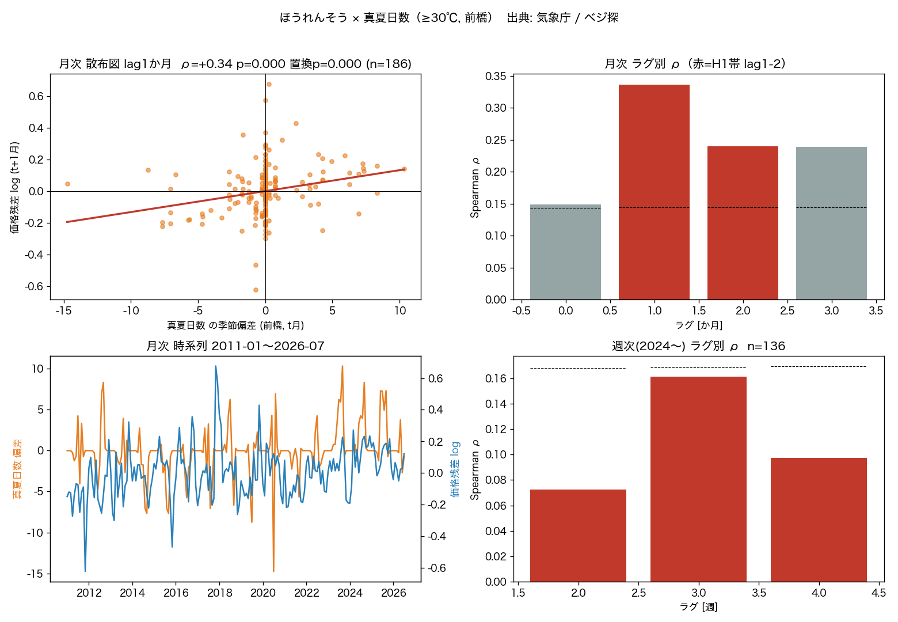
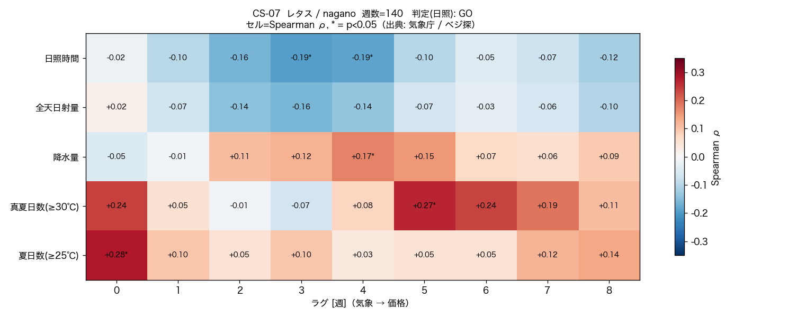
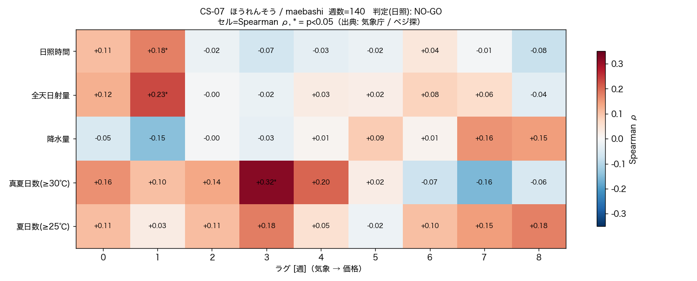
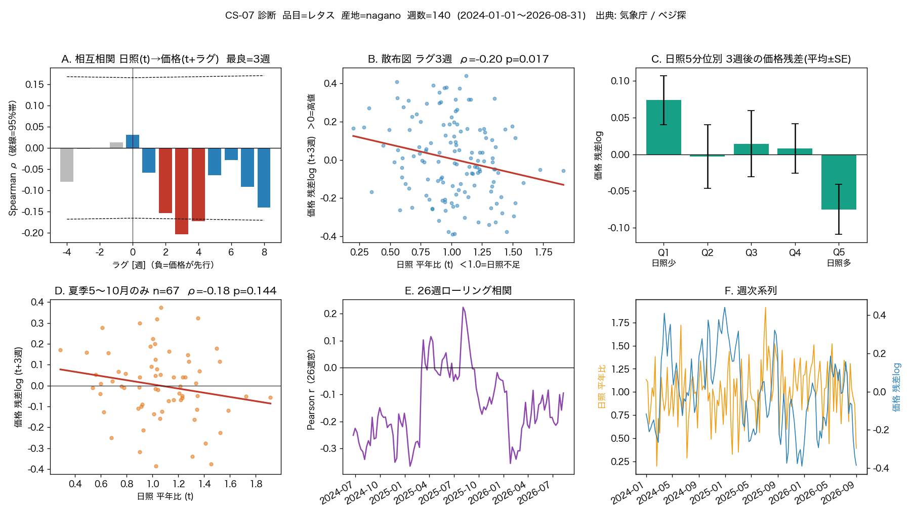
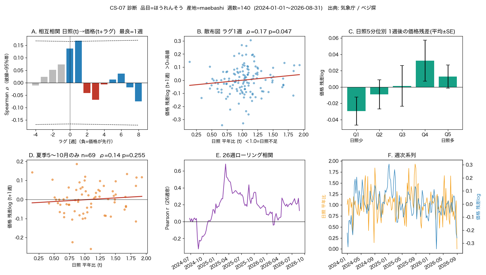

# CS-07 スパイク — 産地の気象 → 数週後の葉物卸売価格

**[← experiments](../README.md)** ・ 対象: [ID-25](../../docs/idea_catalog.md) / [CS-07](../../docs/correlation_studies.md)
経過: ① 日照のみ → NO-GO ／ ② 気象を4特徴に拡張 → ほうれんそう×真夏日数が浮上 ／ ③ **その1本を15年の月次で検証 → 支持**（レタスは②で終了）

## 結論（2026-09-02）
**「気象単独で価格を"当てる"のは無理（r²≲0.2）。だが「前橋の真夏日数（≥30℃の日数）の季節偏差」は、東京のほうれんそう卸売価格の 1〜2か月先行指標として有効。**
**月次15年（2011〜2026, n=186）で ラグ1か月 Spearman ρ=+0.34、暖候期（6〜10月）に絞ると ρ=+0.43（r²≈0.18）。いずれも自己相関に頑健な循環置換検定で p<0.001。**
価格予測モデルの説明変数として十分意味がある強さ。次は交絡統制つきの分布ラグ回帰へ（[ml_models.md](../../docs/ml_models.md)）。

| 検証 | データ | ラグ1か月/3週 の ρ | 頑健性 | 効果量 |
|---|---|---|---|---|
| **③ 月次・長期（本命）** | ベジ探 月別 2011〜2026, n=186 | **+0.336**（暖候期のみ **+0.427**） | 循環置換 p<0.001、95%CI [+0.20,+0.46]（暖候期 [+0.22,+0.59]） | r²≈0.11〜0.18 |
| ② 週次・短期（確認） | ベジ探 日別 2024〜, n=136 | +0.161（lag3週） | p=0.061、循環置換 p=0.10 → 単独では非有意（期間2.7年で検出力不足） | r²≈0.03 |

- **符号は仮説どおり**（真夏日が多い＝暑い → 抽苔・葉焼けで供給減 → 翌月に高値）。ラグ1〜2か月はほうれんそうの生育期間（30〜40日）＋出荷サイクルと符合。
- 週次（2.7年）では同符号だが有意に届かない。サブ月スケールの正確なラグは短期データでは特定できない。月次では明確。
- ②の探索（5特徴×9ラグ=45セル）で最大だった「ほうれんそう×真夏日数」を、**単一仮説として事前登録し**、期間を6倍（186か月）に伸ばし、多重比較を排し、自己相関に頑健な検定で確かめ直した結果。CS-07 全体で初めて厳密な基準をクリアした組み合わせ。

> 副産物: 気象庁 etrn（p1+a3 の複数要素, 2011〜）＋ベジ探 sch7.do（日別 `--`／月別 `--monthly`）の**完全自動取得**コード。

## データ（[CLAUDE.md](../../CLAUDE.md) のルール順守）
| | 取得元 | スクリプト | Python |
|---|---|---|---|
| 気象（日別・降水/最高気温/日照/全天日射） | 気象庁「過去の気象データ検索」 daily_s1.php（view=p1 と a3） | `fetch_jma_daily.py` | ◎ 公開・鍵不要・完全自動 |
| 卸売価格（東京・日別） | ベジ探「卸売市場別入荷量・価格」 sch7.do | `fetch_veg_price.py` | ◎ 鍵不要・完全自動（1リクエスト=1か月） |
| 卸売価格（東京・月次 2011〜） | ベジ探「卸売市場別入荷量・価格」 sch7.do（月別 outPutKbn=1） | `fetch_veg_price.py --monthly` | ◎ 鍵不要・完全自動（1リクエスト=1年） |
| 特徴×ラグの相関＋ヒートマップ（②） | — | `analyze_lag_corr.py` | `results/lag_corr_<品目>.png`, `summary_<品目>.txt` |
| **単一仮説の検証（③・本命）** | — | `analyze_spinach_hotdays.py` | `results/spinach_hotdays.png`, `spinach_hotdays.txt` |
| 日照ディープダイブ（6パネル・①） | — | `plot_diagnostics.py` | `results/diagnostics_<品目>.png`（日照のみ） |

**手動DL不要**。生データは `data/cs07/`（`.gitignore` 済み）。図と集計は `results/`（Git 追跡）。
全天日射量の観測は官署が限られる（長野・前橋・静岡・東京にはあり、諏訪・熊谷には無い）。`config.JMA_STATIONS` の `[日射]` 印を参照。

## 手順
```bash
cd experiments/cs07_veg_price
P=/opt/anaconda3/envs/met_env/bin/python

$P fetch_jma_daily.py maebashi          # 前橋の日別4要素 2011〜2026（p1+a3）約15分
$P fetch_veg_price.py                   # ベジ探 日別 卸売価格 2024〜（週次確認用）
$P fetch_veg_price.py --monthly         # ベジ探 月別 卸売価格 2011〜2026（③の本命データ）
$P analyze_spinach_hotdays.py           # ③ 事前登録した単一仮説の検証 → results/spinach_hotdays.{png,txt}
# 参考: $P analyze_lag_corr.py（②の探索）, $P plot_diagnostics.py（①の日照6パネル）
```

## ③ 単一仮説の検証（本命）— ほうれんそう × 真夏日数
`analyze_spinach_hotdays.py`。②の探索で最大効果量だった1組を**事前登録**し、期間を月次15年に伸ばし、多重比較を排し、自己相関に頑健な**循環シフト置換検定**で確認。



| 検証 | ラグ | ρ | p（通常 / 循環置換） | 95%CI | r² |
|---|---|---|---|---|---|
| 月次 2011〜2026 (n=186) | 1か月 | **+0.336** | <0.001 / <0.001 | [+0.20,+0.46] | 0.113 |
| 月次 2011〜2026 (n=185) | 2か月 | +0.240 | 0.001 / 0.007 | [+0.10,+0.37] | 0.057 |
| 月次 **6〜10月のみ** (n=76) | 1か月 | **+0.427** | <0.001 / <0.001 | [+0.22,+0.59] | **0.182** |
| 週次 2024〜 (n=136) | 3週 | +0.161 | 0.061 / 0.096 | [−0.01,+0.32] | 0.026 |

- **月次は明確に H1 支持**（真夏日数偏差 大 → 1〜2か月後に価格残差 大）。効果量は暖候期で r²≈0.18＝中程度。
- 週次（2.7年）は同符号だが検出力不足で非有意。サブ月スケールのラグは短期データでは決まらない。
- 循環置換検定＝月次の強い自己相関（暑い夏は連続する等）を保ったまま帰無分布を作る。通常の p とほぼ一致 → 見かけの相関ではない。

### 季節・トレンド交絡のチェック（lag1か月・全月）
「夏＝暑い＆夏＝高値」を拾っているだけでは？ という懸念への確認。元の分析は既に**暦月平均を差し引いて**あるので "夏 vs 冬" ではなく**同じ暦月の年々偏差**を見ているが、さらにトレンドも潰す。

| 前処理 | ρ | p |
|---|---|---|
| 月中心化のみ（元） | +0.336 | <0.001 |
| ＋ 線形トレンド除去 | +0.311 | <0.001 |
| **前年同月比 YoY（季節・トレンド完全除去）** | **+0.338** | **<0.001** |

トレンド自体が小さく（真夏日数 +0.14日/年、log価格 +1%/年）、除いても ρ はほぼ不変。前年同月比（今年8月 vs 去年8月）でも同じ。ラグ0(ρ=0.15) < ラグ1(ρ=0.34) とピークが翌月にある点も、共通トレンドの見かけ相関を否定する。→ **季節要因ではなく年々変動の実シグナル。**

## ② 気象特徴 × ラグの探索（2026-09-02）
`analyze_lag_corr.py`。各セル = 週次の「week-of-year 標準化偏差」と、季節調整 log 価格残差（tラグ週後）の Spearman ρ。`*` は p<0.05（多重比較 未補正）。

### レタス / 長野（140週）


- **日照時間**: lag2〜4 が負（lag3 −0.19*, lag4 −0.19*）。当初仮説「日照不足→数週後に高値」と一致。
- **全天日射量**: lag2〜4 が負（lag3 −0.16）。日照と同方向で整合。
- **降水量**: lag2〜5 が正（lag4 +0.17*）。多雨→数週後に高値（病害・生育不良）。
- **高温日数（≥25/30℃）**: lag0 が正（夏日数 +0.28*, 真夏日数 +0.24）。暑い週は"その週"の価格が高い（レタスは高温に弱い）。
- 4チャネルとも「気象ストレス→供給減→高値」で符号が生理的に一貫。ただし \|ρ\|≤0.28。

### ほうれんそう / 前橋（140週）


- **真夏日数（≥30℃）**: **lag3 で ρ=+0.32*（p=0.008, r²≈0.10, n=68）**。本スパイクで最大の効果量。ラグ3週＝生育期間と符合。
- **全天日射量**: lag1 +0.23*（p=0.007）。**日照**: lag1 +0.18*。短ラグの正＝日射・日照が多い週の約1週後に高値。
- **降水量**: lag1 −0.15（p=0.09）。雨で暑さが和らぐ効果か（弱い）。
- レタスと符号が逆（日照・日射・高温いずれも "多い→高値"）＝ほうれんそうは暑さ・強光ストレスに弱い、で一貫。

## ① 日照のみの診断図（`results/diagnostics_<品目>.png`）
日照時間だけを深掘りした6パネル（CCF / 散布図 / 5分位 / 夏季限定 / ローリング相関 / 週次系列）。読み方は各パネル題のとおり。
※ ②の拡張前に作ったもの。レタスは産地を諏訪→長野に変えたため数値が①の結果ログと少し違う。

**レタス** 
**ほうれんそう** 

## 判定基準（σ・p・効果量）
| 基準 | しきい値 | 意味 |
|---|---|---|
| p 値（Spearman, 両側） | < 0.05 で名目有意。ただし 45セル見ているので **×45 で補正**して評価 | 相関が偶然でないと言える最低ライン |
| z = ρ / SE | 有意 1.96σ / "証拠"級 3σ（SE ≈ 1/√(n−1)） | 0 から何σ離れているか |
| 効果量 \|ρ\| | <0.1 無視 / 0.1–0.3 弱 / 0.3–0.5 中 / >0.5 強 | 実務なら \|ρ\|≳0.3（r²≳0.1）が欲しい |
| 事前 GO 条件 | 日照 ラグ2-4週で p<0.05 かつ ρ<0 | 当初登録した唯一の一次仮説 |

## 結果ログ
| 日付 | 段階 | 品目 / 産地 | データ | 主要な所見 | 判定 |
|---|---|---|---|---|---|
| 2026-09-02 | ① 日照のみ | レタス / 諏訪 | 週次139 | 日照 lag3 ρ=−0.159 (p=0.064)。符号は仮説どおりだが非有意 | NO-GO |
| 2026-09-02 | ① 日照のみ | ほうれんそう / 前橋 | 週次139 | 日照 lag1 ρ=+0.178 (p=0.036)。符号が逆・多重比較で非有意 | NO-GO |
| 2026-09-02 | ② 4特徴探索 | レタス / 長野 | 週次140 | 日照 lag3-4 ρ=−0.19、日射・降水も同方向。45セルの多重比較で×。r²≤0.08 → **レタスはここで終了** | 打ち切り |
| 2026-09-02 | ② 4特徴探索 | ほうれんそう / 前橋 | 週次140 | 真夏日数 lag3 ρ=+0.32 (p=0.008)。45セル中で最大効果量 → ③へ | 有望 |
| 2026-09-02 | **③ 単一仮説** | **ほうれんそう / 前橋** | **月次186（2011〜）** | **真夏日数偏差 → +1か月 ρ=+0.336（暖候期 +0.427, r²≈0.18）、循環置換 p<0.001** | **H1 支持** |

## 次にやること
1. **分布ラグ回帰へ**（`docs/ml_models.md`）: 真夏日数（複数ラグ）＋交絡（他産地の作況・需要期ダミー・トレンド）を入れて、真夏日数の限界寄与と符号安定性を確認。
2. **日次で埋める**: 2023年以前の日別価格を e-Stat「青果物卸売市場調査（日別調査）」から足し、週次でもラグ2〜4週の正相関が立つか（月次より実用に近い先行指標になる）。
3. **産地の合成**: 前橋だけでなく 埼玉・千葉・栃木・宮崎（冬）の真夏日数を重みづけ合成して東京入荷を近似。
4. 他の暑さ指標（WBGT・夜間最低気温＝熱帯夜）に置換して効果量が上がるか。
5. 品目拡張: こまつな等の葉物（`config.CROPS` に追加）。
