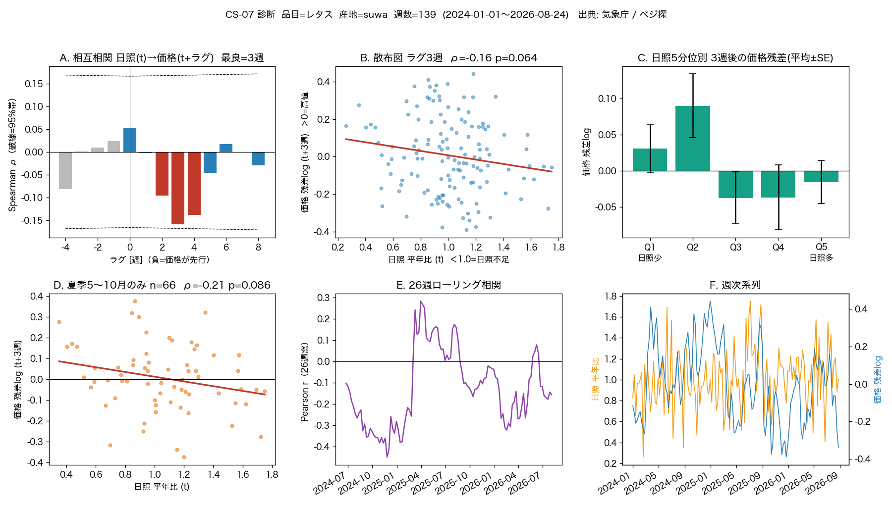

# CS-07 スパイク — 産地の日照不足 → 数週後の葉物卸売価格

**[← experiments](../README.md)** ・ 対象: [ID-25](../../docs/idea_catalog.md) / [CS-07](../../docs/correlation_studies.md)

## 目的（GO/NO-GO）
主産地（レタス＝長野・諏訪）の**週次日照時間の平年比**が、**2〜4週後**の東京卸売価格に先行するか。
仮説どおりなら「日照↓ → 価格↑」＝ **負の相関**。

- **GO**: ラグ 2〜4 週のいずれかで、季節調整後に有意な負の相関（Spearman p<0.05, ρ<0）
- GO したら [ml_models.md](../../docs/ml_models.md) の分布ラグ回帰 → ID-25 候補設計へ

## データ（[CLAUDE.md](../../CLAUDE.md) のルール順守）
| | 取得元 | スクリプト | Python |
|---|---|---|---|
| 気象（日照時間・日別） | 気象庁「過去の気象データ検索」 daily_s1.php | `fetch_jma_sunshine.py` | ◎ 公開・鍵不要・完全自動 |
| 卸売価格（レタス・東京・日別） | ベジ探「卸売市場別入荷量・価格」 sch7.do | `fetch_veg_price.py` | ◎ **鍵不要・完全自動**（1リクエスト=1か月をループ） |
| （分析）ラグ相関＋判定 | — | `analyze_lag_corr.py` | GO/NO-GO と `results/lag_corr.png` |
| （分析）診断図 | — | `plot_diagnostics.py` | `results/diagnostics.png`（6パネル） |

**手動DLは不要**。両方ともスクリプトが取得する。生データは `data/cs07/`（`.gitignore` 済み）。**図と集計は `results/`（Git 追跡）**＝下記「結果ログ」から参照する代表実行の成果。スクリプトを回すと `results/` が上書き更新される。

## 手順
```bash
cd experiments/cs07_veg_price
P=/opt/anaconda3/envs/met_env/bin/python   # conda activate met_env でも可

$P fetch_jma_sunshine.py        # 日照（config.py の YEAR_START〜YEAR_END, 諏訪/東京/静岡）約8分
$P fetch_veg_price.py           # ベジ探から卸売価格（VEG_YEAR_START〜END, 東京・レタス）約1分
$P analyze_lag_corr.py          # ラグ相関＋GO/NO-GO判定 → results/summary.txt, results/lag_corr.png
$P plot_diagnostics.py          # 相関を「見て分かる」6枚組の診断図 → results/diagnostics.png
```

## 診断図（[results/diagnostics.png](results/diagnostics.png)）の読み方
| パネル | 見るもの | 仮説が正しいときの見え方 |
|---|---|---|
| A 相互相関(CCF) | ラグ -4〜+8 週の Spearman ρ | ラグ +2〜4週が負、負ラグ（価格→日照）はゼロ＝**非対称**なら因果向きが正しい |
| B 散布図 | 日照平年比(t) vs 価格残差(t+最良ラグ) | 右下がり（日照↓→価格↑） |
| C 5分位バー | 日照を5等分し各群の後続価格残差 | Q1(日照少)が高値、Q5(日照多)が安値へ**単調** |
| D 夏季のみ | 5〜10月（諏訪が主産地）に限定した散布図 | 通年より相関が強い＝産地シフトが希釈要因の証拠 |
| E ローリング相関 | 26週窓の相関の推移 | 概ね負で安定していれば頑健 |
| F 週次系列 | 日照平年比と価格残差の生の動き | 日照の谷の数週後に価格の山 |

## 価格データのバックエンド（config.PRICE_BACKEND）
- **`vegetan_auto`（既定・推奨）**: ベジ探 `sch7.do` を自動取得。
  フロー = GET(セッション) → POST `CMD=search` → GET `CMD=downLoad&sv...`（sv* は空でも全項目必須、欠けると404）。
  日別データは **2024年〜**。コードは `config.py`（`city=101` 東京都、`hinmokuCode=33400` レタス）。
- `manual`: `data/cs07/` に `veg_price_manual.csv`（列 date,price）か ベジ探手DLの `SCH*.csv`（複数可）を置く。
- `estat`: e-Stat API（`ESTAT_APP_ID` 環境変数＋`STATS_DATA_ID`）。青果物卸売市場調査など。2023年以前の日別はこちら or 農水省「青果物卸売市場調査（日別調査）」。

## 既知の注意点
- **産地シフト**: レタスは夏＝長野、冬＝静岡・茨城など主産地が季節で変わる（CS-07 の「癖」）。
  まず諏訪で通年を見て、弱ければ「夏だけ（5〜10月）諏訪」に絞る、静岡を冬に足す。
- **季節交絡**: 価格は季節性が強い。`analyze_lag_corr.py` は週番号ごとの平均 log 価格を引いて残差で相関を取る。
- 日照の平年比の分母は取得年数ぶんの平均（数年ぶんなので粗い）。年数を伸ばすほど安定。
- 気象庁 etrn は 1 リクエスト＝1か月。`REQUEST_INTERVAL_SEC` で間隔を空けている。

## 結果ログ
| 日付 | 品目 / 産地 | 重複週数 | ラグ2-4週の ρ (p) | 判定 | メモ |
|---|---|---|---|---|---|
| 2026-09-02 | レタス / 諏訪（通年） | 139 (2024-01〜2026-08) | lag3 ρ=-0.159 (p=0.064), lag4 ρ=-0.138 (p=0.111) | **NO-GO（弱いが符号は仮説どおり）** | 気象庁＋ベジ探を完全自動で取得。lag3-4で日照↓→価格↑の傾向はあるが有意水準に届かず。通年で諏訪固定＝産地シフトの希釈が主因と推定 |



*6パネル診断図（[results/diagnostics.png](results/diagnostics.png)）。ラグ別のシンプルな判定図は [results/lag_corr.png](results/lag_corr.png)、数値は [results/summary.txt](results/summary.txt)。*

所見（2026-09-02）:
- **A**: CCFはラグ+2〜4週が負・負ラグはゼロで**非対称** → 「日照が価格に先行」の向きは支持される（偶然の相関なら対称に出やすい）。ただし lag3 は95%帯に触れる程度。
- **D**: 夏季(5〜10月)のみだと ρ=-0.21 (p=0.086) と通年より強い → 産地シフトの希釈仮説を支持。
- **C**: 5分位は非単調（Q2が最も高値、Q1はそれほどでも）→ 「単週の日照不足」より「数週の累積不足」で見るべき兆候。
- **E**: ローリング相関は -0.45〜+0.25 で不安定 → 2.7年・諏訪のみでは頑健でない。期間延長と産地の作り込みが必要。

### 次に試すこと（弱シグナルを追う）
1. **夏だけ（諏訪が主産地の5〜10月）に限定**して再計算。冬は静岡/茨城の日照へ差し替え。
2. 日照指標を「2〜3週の累積不足（平年比の移動和）」に変更。単週より効くはず。
3. 価格変換を YoY 変化率 or ローリング detrend に（週番号平均は2.5年ぶんで不安定）。
4. 期間を伸ばす: 2023年以前の日別は e-Stat「青果物卸売市場調査（日別調査）」から足す。
5. `sun_anom_z`（既に算出済み・未使用）でも相関を取る。
