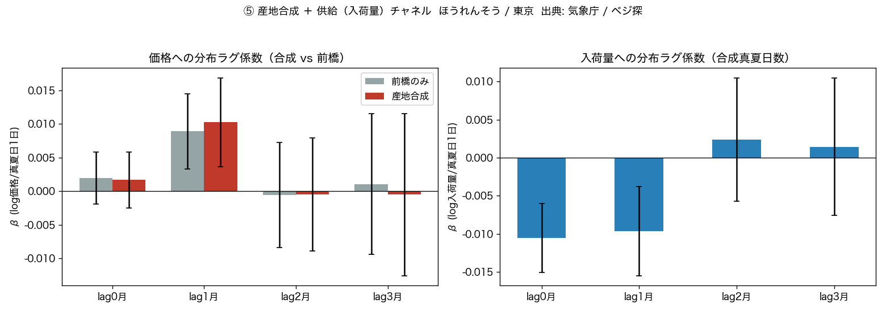
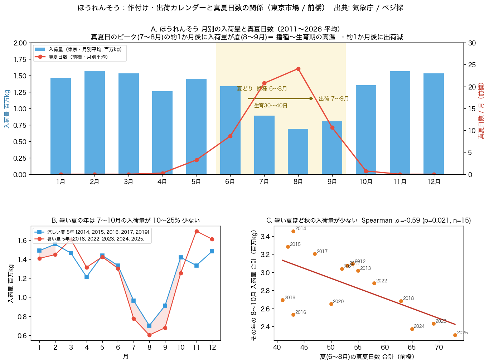

<!--
プレゼン用のまとめ（Marp ソース）。
- 各 `---` が1スライド。長いスライドは適宜分割してよい。
- 技術的な詳細は SPINACH_FINDINGS.md、経緯は README.md を参照。
- 図は results/ 配下（このファイルと同じディレクトリからの相対パス）。
- 出典表記: 図・数値には「気象庁ホームページ」「農畜産業振興機構 ベジ探（東京都中央卸売市場データ）」を明記。
-->

# 気象は野菜の卸売価格を先読みできるか
## ほうれんそう × 真夏日数（東京市場 / 2011–2026）

ID-25「生鮮野菜価格の気象先行指標」 / CS-07 の検証結果

**一行で**: 産地で真夏日（最高気温 ≥30℃）が平年より多い月の**翌月**、東京市場のほうれんそうは**入荷量が減り、卸売価格が上がる**（真夏日 +10日 → 翌月 価格 +約10% / 入荷量 −15%）。

---

## 1. はじめに — なぜ「ほうれんそう」か

このプロジェクトの狙いは「**気象データが、他分野の数字を数週間先読みできる組み合わせ**」を探すこと。野菜の卸売価格はその有力候補。

最初はレタス × 日照不足を試したが相関は弱かった。そこで気象側を **日照・全天日射・降水・高温日数** に広げ、葉物 × ラグ 0〜8 週を総当たりで探索したところ——

**「ほうれんそう × 真夏日数」だけが、価格変動の1割超を説明する（r² ≥ 0.1）唯一の組み合わせ**として際立った。

---

## 1. はじめに — ほうれんそうを選んだ4つの理由

| # | 理由 |
|---|---|
| 1 | **生理的に暑さへ極端に弱い冷涼性作物**。生育適温 10〜20℃、25℃で生育停止、30℃で発芽率が激減 → 気象と価格が結びつく強い事前理由がある |
| 2 | **探索で最大の効果量**だった（45セル中で唯一 r² ≥ 0.1） |
| 3 | **夏の価格高騰が市場で周知の現象**。データでも夏（7〜9月）の入荷量は冬の約半分 |
| 4 | **生育期間が 30〜40日と短い** → 気象ストレスが約1か月で出荷・価格に反映され、検出しやすい |

レタスも冷涼性だが、主産地（長野の高冷地）の暑さの年々変動が小さく、日射観測点の制約もあってシグナルが弱かった。

---

## 2. なぜ、この検証が「回せた」のか — データ取得の容易さ

気象 × 価格の相関を見るには、**両側に「誰でも同じ手順で取れる長期の公開データ」**が要る。ふつうは価格側がネック（POSは有料、多くは登録制）。

- **気象側**: 気象庁「過去の気象データ検索」で、日別の気温・降水・日照・日射を**官署単位**で。鍵不要・スクリプトで全自動。
- **価格側**: 東京都中央卸売市場の実績が **農畜産業振興機構「ベジ探」** で公開されている。
  - 月別 入荷量・価格: **1984年〜**（本検証は 2011〜2026 を使用）
  - 日別: 2024年〜 ／ **産地別の数量つき**（産地ウェイトを作れる）
  - 鍵不要。検索フォーム（POST）＋ダウンロードURL で**完全自動取得**できた。

→ **気象庁 ＋ ベジ探だけで、15年分の月次パネルを全自動で構築**。これがテーマを実行可能にした。

---

## 2. データ取得元（URL）

| 用途 | サイト | URL |
|---|---|---|
| 気象（日別・官署） | 気象庁 過去の気象データ検索 | https://www.data.jma.go.jp/stats/etrn/index.php |
| 気象（CSV一括） | 気象庁 過去の気象データ・ダウンロード | https://www.data.jma.go.jp/risk/obsdl/index.php |
| 卸売 入荷量・価格・産地別 | 農畜産業振興機構「ベジ探」 | https://vegetan.alic.go.jp/ （卸売市場別入荷量・価格: `.../vegetan/sch7.do?outPutKbn=1`） |
| 2023年以前の日別卸売 | 農水省 青果物卸売市場調査 / e-Stat（要 appId） | https://www.maff.go.jp/j/tokei/kouhyou/seika_orosi/ |
| 小売価格（参考・週次） | 農水省 食品価格動向調査 | https://www.maff.go.jp/j/zyukyu/anpo/kouri/ |
| 栽培（生理の裏付け） | タキイ種苗 栽培マニュアル ／ JA新みやぎ | https://www.takii.co.jp/tsk/manual/hourensou.html ／ https://www.pref.miyagi.jp/documents/45159/horenso-manual.pdf |

---

## 3. 仮説（事前登録）

> **H1**: 産地（前橋ほか）の「真夏日数（最高気温 ≥30℃ の日数）」の**季節偏差**が大きい月ほど、その **1〜2 か月後**の東京のほうれんそう**卸売価格（季節調整済み）が高い**。ρ > 0、p < 0.05。

- 「季節偏差」= その月の値 − 同じ暦月の15年平均 → **「夏 vs 冬」ではなく、同じ8月どうしを年またぎで比べる**。
- 探索で見つけた1組を**単一仮説に絞り**、期間を月次15年に拡張、多重比較を排し、自己相関に頑健な検定で確かめ直した。

---

## 4. 方法 — 6段階

| 段階 | 内容 |
|---|---|
| ① | 日照だけ → 相関弱く NO-GO |
| ② | 気象を4特徴（日照・日射・降水・高温日数）× ラグ0〜8 に拡張 → **ほうれんそう×真夏日数**が最大効果量 |
| ③ | その1本を **月次15年（n=186）** で検証（循環シフト置換検定で自己相関に頑健化） |
| ④ | **分布ラグ回帰**（Newey-West HAC）で 季節・トレンド・前月価格・降水 を統制 |
| ⑤ | **7官署の産地合成**、および **入荷量（供給）** の回帰で経路を確認 |
| ⑥ | 「月次 Yes/No の早期警戒アラート」として使えるか検証 |

---

## 5. 結果 ① 相関（月次15年）

| ラグ | Spearman ρ | p（通常 / 循環置換） | r² |
|---|---|---|---|
| 1 か月 | **+0.34** | <0.001 / <0.001 | 0.11 |
| 1 か月（暖候期 6〜10月, n=76） | **+0.43** | <0.001 / <0.001 | **0.18** |

効果は**ラグ1〜2か月**にあり、同月は弱い。真夏日が多い月ほど翌月の価格が高い。

---

## 5. 結果 ① 相関 — 頑健性

- **しきい値をずらしても不変**: 最高気温 ≥24〜34℃ のどの日数でも、月平均最高気温・超過度日でも ρ ≈ 0.3〜0.47。30℃ 固有ではなく「暑さ」全般。
- **季節・トレンドを除いても不変**: 暦月平均を引いた残差 → 線形トレンド除去 → 前年同月比（YoY）のいずれでも ρ ≈ +0.34。
- ラグ0（同月, ρ=0.15）< ラグ1（ρ=0.34）とピークが翌月にある形も、共通トレンド由来の見かけ相関を否定。

---

## 5. 結果 ② 分布ラグ回帰（交絡統制）

`log(価格_t) ~ トレンド + 暦月ダミー + Σ 真夏日数偏差_{t−k} (+ 降水, + 前月価格)`
標準誤差 = Newey-West HAC

| モデル | 統制 | 真夏日数偏差 L1 の β | HAC t | p |
|---|---|---|---|---|
| M1 | 季節・トレンド | +0.0096 | +3.4 | 0.001 |
| M3 | ＋降水＋**前月価格(AR1)** | +0.0096 | +3.3 | 0.001 |
| M4 | M3 を暖候期に限定 | +0.0096 | +3.2 | 0.001 |

**全モデルで β ≈ +0.0096、t > 3。** 効果はラグ1か月に集中。**真夏日 +10日 → 翌月の価格 +約10%。**

---

## 5. 結果 ③ 産地合成 ＋ 供給チャネル

- **産地合成**（群馬・茨城・栃木・埼玉・千葉・岩手・岐阜 の真夏日数を東京入荷ウェイトで加重）→ 価格 L1 β=+0.0103（前橋1点とほぼ同じ）。**前橋1点で関東平野の暑さの良い代理**。
- **入荷量の回帰**: 真夏日数偏差 → log入荷量 L0 β=−0.011（t=−4.6）、L1 β=−0.010（t=−3.2）。**真夏日 +10日 → 入荷量 −15%。**
- → 価格上昇の経路は**供給（入荷量）の減少**。量 −15% ↔ 価格 +10% は需要弾力性 ≈ −0.7 で整合。

---

## 5. 結果 ④ 出荷カレンダー

- **A**: 入荷量は 7〜9月が深い谷（冬の約半分）。真夏日ピーク（7〜8月）の**約1か月後**に入荷が底 → 夏どりの播種〜生育期（6〜8月）に高温が当たる構造。
- **B**: 暑い夏5年 vs 涼しい夏5年 → 暑い夏は **7〜10月の入荷量が 10〜25% 少ない**。
- **C**: 夏（6〜8月）の真夏日数 × その年の 8〜10月 入荷量 → **Spearman ρ = −0.59（p=0.021, n=15）**。

---

## 5. 結果 ⑤ 早期警戒アラートとしては「弱い」

出荷月の前の30日窓の真夏日数で「**その時代なりに**高値か（トレンド除去後 上位1/3）」を当てられるか（暖候期 n=76）。

| 指標 | 値 |
|---|---|
| AUC（0.5=無意味） | 約 **0.55**（トレンド除去後） |
| アラートのリフト | **約 1.0倍**（基準33%、TP=9 / FP=17 / FN=16） |
| トレンド統制（`+ year`） | 窓の真夏日係数 **p=0.24** |

- 2023・24・25 の高値は拾えるが、2015・16・20 を見逃し、2011・17・18・22 は空振り。
- 見かけの当てる力は**ほぼ「近年ほど暑くて高い」というトレンド由来**。
- **連続効果（④）は本物だが、月次 Yes/No の断定には落ちない。** 使うなら「連続のリスク指標」＋週次化＋複数チャネル。

---

## 6. 数値の読み方（プレゼンで問われがちな点）

| 記号 | 意味 | この検証での値 |
|---|---|---|
| **ρ** | 順位相関（−1〜+1）。連動の**強さ**と向き | +0.34（暖候期 +0.43）＝弱〜中 |
| **r²** | 変動の**何割を説明**するか | 約11%（暖候期18%）。残りは他産地の天候・需要・コスト等 |
| **β** | 回帰の傾き＝**効果の大きさ（単位つき）** | +0.0096 → 真夏日1日で翌月 +約1%、10日で +約10% |
| **adj.R²** | モデル**全体**の説明力 | 0.71（大半は季節＋前月価格。真夏日の上乗せは +0.003） |
| p / 95%CI | 偶然でない確率 / 真値の範囲 | p<0.001、CI [+0.20, +0.46]（0を含まない） |

**なぜ ρ=0.3〜0.4 で「意味あり」か**: 市場価格は多因子。単一の生の気象変数で 0.7〜0.8 は原理的に出ない（社会科学の目安: 0.1 小 / 0.3 中 / 0.5 大）。重要なのは (1) 偶然でない (2) 他要因を統制しても残る (3) 方向と時間構造が生理と一致。

---

## 7. 園芸学的根拠（統計と生理が一致）

| 事項 | 内容 |
|---|---|
| 生育適温 | 10〜20℃。**25℃以上で生育停止**、暑さに極めて弱い |
| 発芽 | 適温 15〜20℃。**25℃超で悪化、30℃以上で発芽率が激減** |
| 抽苔（とう立ち） | 花芽分化は発芽後15〜30日。高温・長日で促進。夏まきは雨よけ＋遮光が必須 |

- 相関が立ち上がる **24〜25℃** ＝「生育停止」ライン、最強の **28〜32℃** ＝「発芽激減」帯。
- ラグ1〜2か月 ＝ 播種〜生育期の高温 → 発芽不良・生育不良・抽苔 → 収穫・出荷減 → 価格上昇、という作物サイクル。

出典: タキイ種苗 栽培マニュアル、JA新みやぎ ほうれん草栽培マニュアル ほか。

---

## 8. 解釈と限界

- **直接の高温被害と、農家の作付け判断（暑い時期の播種を減らす／遅らせる）は分離できない**。どちらも「暑さ → 約1か月後に供給減 → 価格上昇」。先行指標としてはどちらでも成立。
- **暑夏に冷涼産地へ発注を振り替える適応は確認できず**。夏の冷涼産地シェアは暑さと無相関で、構造的に減少（2011年25% → 2025年7%）。適応は産地内（施設・遮光・品種・作付け時期）で起きているとみられる。
- **予測 R² の上乗せは小さい**（前月価格＋暦月ダミーで adj.R²≈0.71、真夏日数を足しても +0.003）。
- **週次（日次データ 2024〜, 2.7年）では非有意**（ラグ3週 ρ=+0.16, p=0.06）。期間が短く検出力不足。
- 効果量は最大でも r² ≈ 0.18。「気象単独で価格水準を当てる」用途には足りない。

---

## 9. まとめ

- **確認できたこと**: 「産地の真夏日数 → 翌月のほうれんそう卸売価格・入荷量」は、相関 → 頑健性 → 交絡統制の分布ラグ回帰 → 供給チャネル まで一貫して残る、**物理的に筋の通った先行関係**。真夏日 +10日 → 翌月 価格 +約10% / 入荷量 −15%。
- **使い方**: 精密な価格予測にはならない。**「暑い夏 → 来月ほうれんそうが高い／品薄」という連続的なリスク指標**として、他の情報と組み合わせて使う。
- **副産物（再利用可能な資産）**: 気象庁 etrn ＋ ベジ探（日別・月別・産地別）の**完全自動取得コード**、分布ラグ回帰スクリプト一式。他の葉物（こまつな等）へそのまま横展開できる。

---

## 10. 出典

- 気象データ: **気象庁**「過去の気象データ検索」 https://www.data.jma.go.jp/stats/etrn/ ／「過去の気象データ・ダウンロード」 https://www.data.jma.go.jp/risk/obsdl/index.php
- 卸売データ: **農畜産業振興機構「ベジ探」**（東京都中央卸売市場データ） https://vegetan.alic.go.jp/
- 補完（2023年以前の日別）: 農林水産省「青果物卸売市場調査」 https://www.maff.go.jp/j/tokei/kouhyou/seika_orosi/
- 栽培・生理: タキイ種苗 https://www.takii.co.jp/tsk/manual/hourensou.html ／ JA新みやぎ ほうれん草栽培マニュアル https://www.pref.miyagi.jp/documents/45159/horenso-manual.pdf
- 詳細な数値と手順: `SPINACH_FINDINGS.md` ／ 経緯: `README.md`（同ディレクトリ）
