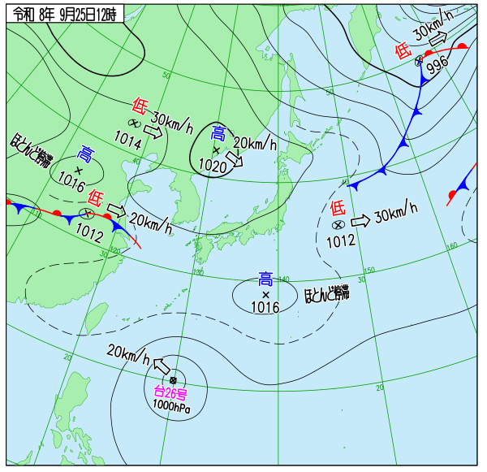
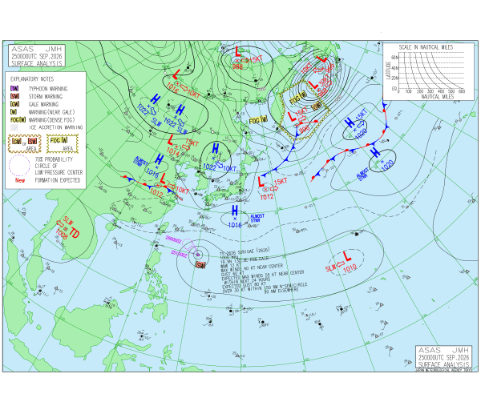
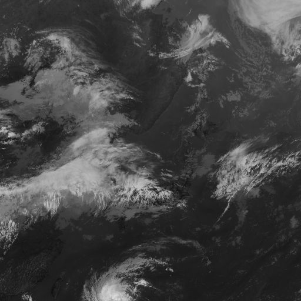

# ID-32 スパイク: 画像一覧と読み解き（2026-09-25）

**[← README](README.md)** ・ 構造化出力: [vlm_output_20260925.json](vlm_output_20260925.json) ・ 検証: [validate.py](validate.py)

VLM 役（Claude Code セッション）が実際に読んだ画像と、その読み取り内容の一覧。画像は [images/](images/) に同梱（手元の `data/` は git 除外のためコピー）。
**出典: 気象庁ホームページ**（天気図・ひまわり画像）。ひまわり画像はタイル 4 枚を結合した加工物。

> 読み取りは目視ベースで、画像上の細かな数字・記号は拡大して確認したが誤読の可能性は残る。**事例1件・非盲検**（[README の限界](README.md#限界過大評価しないために) 参照）。

## 画像一覧
| # | ファイル | 内容 | 対象時刻 | 取得元 |
|---|---|---|---|---|
| 1 | [20260925_surface_near_03Z.png](images/20260925_surface_near_03Z.png) | 地上天気図（日本近海） | 9/25 12時JST（03UTC） | `weather_map/data/png/…JCIspas…` |
| 2 | [20260925_surface_asia_00Z.png](images/20260925_surface_asia_00Z.png) | 地上天気図（アジア太平洋、ASAS） | 9/25 9時JST（00UTC） | `weather_map/data/png/…JCIasas…` |
| 3 | [20260925_ir_b13_03Z.png](images/20260925_ir_b13_03Z.png) | ひまわり赤外（B13）、東経約112〜157度・北緯約22〜55度 | 9/25 12時JST（03UTC） | `himawari/data/satimg/…/fd/…/B13/TBB/4/{13,14}/{5,6}.jpg` を結合 |

アジア図は 6 時間毎のため 03UTC が無く、3 時間前（00UTC）を使用。#1 と #3 は同時刻。

---

## 1. 地上天気図（日本近海）9/25 12時JST

**読み取り**
- **日本付近は高気圧圏内**。日本海〜朝鮮半島付近に **高気圧 1020hPa**（東へ約 20km/h）、日本の南海上に **高気圧 1016hPa**（ほとんど停滞）。本州付近は等圧線がまばらで気圧傾度が小さい ＝ 風が弱い。
- **華中に低気圧 1012hPa**（東へ約 20km/h）。西へ **停滞前線**（赤と青の記号が両側に付く線）が伸び、低気圧の東側へ赤い線（温暖前線的な線）が延びる。これが西から日本へ近づく側。
- **北東中国に低気圧 1014hPa**（東へ約 30km/h）。北海道へは翌日以降に接近する位置。
- 日本の東海上に **低気圧 1012hPa**（東へ約 30km/h）と前線。北東の隅には **996hPa の低気圧**（寒冷前線・温暖前線を伴う）。いずれも日本から離れていく。
- **台風26号 1000hPa** がフィリピンの東方、日本の南に位置し **北西へ約 20km/h**。日本本土からは遠い。

**気圧配置の判定: 移動性高気圧型**（確信度 0.7）。秋の典型で、冬型（西高東低）や梅雨・秋雨前線型ではない。

## 2. 地上天気図（アジア太平洋）9/25 9時JST

**読み取り**（#1 の 3 時間前。全体像の確認用）
- 大陸に **高気圧が並ぶ**（1022hPa が複数、1016hPa）。日本海〜朝鮮半島付近の **1022hPa** は東へ約 10kt。**#1（03UTC）で 1020hPa** になっており、3 時間で示度が下がっている ＝ 図同士の整合が取れる。
- **華中の低気圧 1012hPa**（東へ 10kt）と停滞前線、**北東中国の低気圧 1014hPa**（東へ 15kt）、その北にも低気圧 1016hPa（10kt）と、オホーツク方面に発達した低気圧 988hPa。
- 日本の東には **低気圧 1012hPa（15kt）** と、そこから北東へ延びる**寒冷前線・温暖前線**。
- 台風26号（英文注記に 1000hPa、中心付近最大風速 40kt、24 時間後に 55kt 予想の旨）。小さな注記文字の読み取りなので**要目視確認**。
- 大陸の西側（インドシナ付近）には **TD（熱帯低気圧）1008hPa**。

## 3. ひまわり赤外（B13）9/25 12時JST

**見方**: 明るい（白い）ほど雲頂が冷たい ＝ **高い雲**。暗い所は晴れ or 低い雲。画像の向きは上が北。

**読み取り**（#1 の天気図との対応）
- **左〜中央（大陸〜東シナ海）**: 南西〜北東に伸びる**帯状の厚い雲**。#1 の華中の低気圧・停滞前線に対応する。西日本の西〜南西方まで達し、**翌26日に前線が西日本にかかる**という予報と整合する。
- **下部（左寄り）**: **渦を巻く雲** ＝ 台風26号。
- **右上**: 大きな渦状の雲 ＝ #1 の 996hPa の低気圧。
- **右中**: 日本の東海上の雲域 ＝ #1 の前線を伴う低気圧 1012hPa。
- **日本列島付近**: 雲が少なく暗い領域が広い ＝ 高気圧に覆われている。

---

## 実況・予報との突き合わせ
| 見立て（画像から） | 実況（アメダス 9/25 12時JST） | 府県予報概況（同日） |
|---|---|---|
| 高気圧に覆われ穏やか | 主要 8 地点すべて降水 0mm、風 2.0〜5.6m/s | 「高気圧に緩やかに覆われる」（東京・新潟・石川）|
| 西から前線が接近（翌日） | — | 東京「26日は前線が西日本から伊豆諸島付近を通って日本の東へ」、石川「26日は前線や湿った空気の影響」|
| 北海道に気圧の谷 | — | 北海道「26日夜には沿海州の低気圧を含む気圧の谷が近づく」|
| 台風は日本から遠い | 那覇でも降水 0mm、風 5.1m/s | 東京・北海道の概況に台風の言及なし |

※ 明日の見立ては、画像を読む前に予報概況を読んでいたため**割り引いて見ること**（非盲検）。突合の自動チェック結果は [README](README.md) と [validate.py](validate.py) の出力を参照。

## 出典・利用について
- 天気図・ひまわり画像・アメダス・予報: **気象庁ホームページ**（<https://www.jma.go.jp/>）。気象庁ホームページの利用規約（出典明記、加工した旨の記載）に従う。
- #3 は 4 枚のタイル画像を結合した**加工物**。
