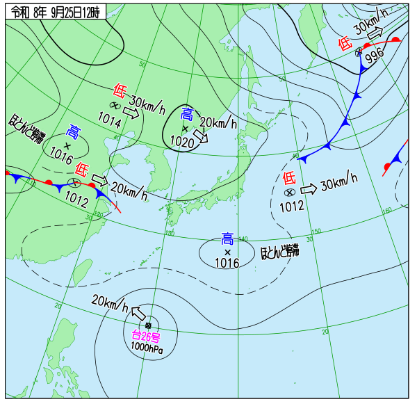

<!--
ID-32「天気図VLM解説」の検証まとめ（ハッカソン準備・第一次候補の中間報告用）。
各 `---` が1スライド。詳細は README.md / CHARTS.md / results_historical.json を参照。
出典: 気象庁ホームページ（天気図・衛星・アメダス・「日々の天気図」アーカイブ）。
-->

# 天気図、AIは読めるか
## ID-32 天気図VLM解説 — 検証まとめ

気象×生成AIハッカソン 事前準備 / 第一次候補の検証結果（2026-09-28）

---

## 課題

天気図は情報密度が高いが、読み方を知らないと意味が取れない。

- 予報士の解説は数が限られ、一般には届きにくい
- 等圧線・前線記号・示度が密に描かれた画像 → 従来は専用の画像処理が必要
- **VLM（Vision-Language Model）なら画像を渡すだけで読める**

対象: 気象に興味のある一般人、防災担当者、理科教育、気象予報士試験の学習者

---

## 提供する体験

1. 今日の天気図＋衛星画像を取得 → VLMが気圧配置を判定し平文で解説
2. 冬型／南岸低気圧／梅雨前線／台風／移動性高気圧 等のラベル＋根拠を提示
3. 教材モード: 天気図の要素を指し示しながら解説、クイズで理解度チェック
4. 過去の同じ日の天気図と比較（拡張）

---

## データ取得の配管 — 実装済み

`fetch_chart.py`: 気象庁 bosai から**認証不要**で取得

| データ | 内容 | 更新間隔 |
|---|---|---|
| 地上天気図 | 日本近海・アジア太平洋 | 3〜6時間毎 |
| ひまわり赤外(B13) | 衛星画像 | 10分毎 |
| アメダス実況 | 主要8地点の気温・風・降水 | 10分毎 |
| 府県予報概況 | テキスト | 日3回程度 |

天気図の対象時刻に衛星・アメダスを時刻合わせして取得

---

## VLM出力の実例（2026-09-25）

**判定**: 移動性高気圧に緩やかに覆われる。雨の心配は小さい（確信度0.65）
根拠3点: 示度1020・1016hPa／等圧線間隔／台風位置

---

## 実際のClaude APIで呼び出し確認

`vlm_read.py`: 画像＋実況・予報を実際にAPIへ送信

- モデル: `claude-sonnet-5`
- **コスト: $0.018/回**（入力4,615 / 出力883トークン）
- ガードレール検証（`validate.py`）: **NG 0件 / 注意2件**
  - 注意点は「予報テキストとの言及有無の差異」のみ（誤りではない）

→ 想定の「数十円で試せる」規模を確認

---

## ガードレール（6項目）

もっともらしい嘘・誤読を検出する仕組み

| # | チェック内容 |
|---|---|
| 1 | ラベル許可リスト（自由記述の断定を禁止） |
| 2 | 季節整合（6月に「冬型」等を機械的に弾く） |
| 3 | 確信度（<0.6は「判断が難しい」を明示） |
| 4 | 数値引用（実況・予報にない数字を書かせない） |
| 5 | 実況突合（降水・風の申告と実測を照合） |
| 6 | 予報突合（VLMの言及と公式予報の言及を比較） |

自己テスト: 初回2/3 → 季節整合ルール追加で **3/3**

---

## 複数事例での正答率 — 15事例・67%

気象庁「日々の天気図」アーカイブ（2002年8月〜の月次PDF）から
7パターン×15事例を抽出し、天気図単体（実況・予報なし）で判定

| 結果 | 件数 |
|---|---|
| 正解 | 10 / 15（**67%**） |
| コスト | $0.065（合計） |

正解ラベルは気象庁予報官が書いた見出し（例:「冬型の気圧配置」）を採用

---

## 分かったこと

- ✅ **台風・梅雨前線・移動性高気圧は強い**（台風3/3, 移動性高気圧2/2）
- ⚠️ **「日本海低気圧」を2/2とも「南岸低気圧」に誤答**（系統的な混同）
  - 低気圧の存在は検出できるが、地域の判定を間違えやすい
- ⚠️ **6月データを「秋雨前線」と誤答**（確信度0.75の高確信度エラー）
  - → **季節整合ガードレールで機械的に弾ける実例を確認**（9〜11月限定のラベル）
- 正答時の平均確信度 0.72、誤答時 0.61（弱いが手がかりになる）

---

## 3分デモ筋書き（実測データに基づく）

| 時間 | 内容 |
|---|---|
| 0:00–0:20 | 生の天気図を見せ「これ、読めますか?」 |
| 0:20–0:50 | 入力→出力（実測例で解説・根拠3点） |
| 0:50–1:30 | **信頼性を見せる**（確信度・ガードレール・正答率67%を隠さず） |
| 1:30–2:00 | 読者切替（一般⇄子ども） |
| 2:00–2:40 | 教材モード・クイズ |
| 2:40–3:00 | 締め「予報を"読む力"を、誰でも持てるように」 |

**差別化ポイント**: 当たる時だけを見せず、外れる可能性も自己申告できる誠実さ

---

## 既存資産・実装状況

| 項目 | 状態 |
|---|---|
| データ取得（`fetch_chart.py`） | ✅ 実装済み |
| VLM呼び出し（`vlm_read.py`） | ✅ 実装済み・実測済み |
| ガードレール（`validate.py`） | ✅ 実装済み・自己テスト3/3 |
| 教材モードRAG（`RAG_met`） | ✅ 動作確認済み（出典ページ付き回答） |
| Web UI（画像＋解説表示） | ⬜ 未着手（既存の公開資産に該当なし、新規に用意） |
| 教材モード（クイズ） | ⬜ 未着手 |

---

## リスクと対策

| リスク | 対策 |
|---|---|
| VLMの誤読 | 数値引用・ラベル許可リスト・予報突合・確信度表示（実測で機能確認済み） |
| 分類精度が低いパターンがある | confidenceで警告、弱いパターンはデモで避ける／今後データを増やして測る |
| 「予報と同じで新規性が薄い」と見られる | 誠実さ・教材モード・過去比較で差別化 |

---

## まとめ

- データ取得〜VLM呼び出し〜検証まで**実コードで通しで成立**
- 複数事例で**正答率67%を実測**（台風・梅雨前線・移動性高気圧は強い）
- ガードレールが実際に誤答を検出する場面も確認
- **暫定の第一候補としてID-32に絞り、次はデモUI・教材モードの実装へ**

詳細: [experiments/cs32_chart_vlm/README.md](README.md) / [docs/candidates/c32_weather_chart_vlm.md](../../docs/candidates/c32_weather_chart_vlm.md)

出典: 気象庁ホームページ
