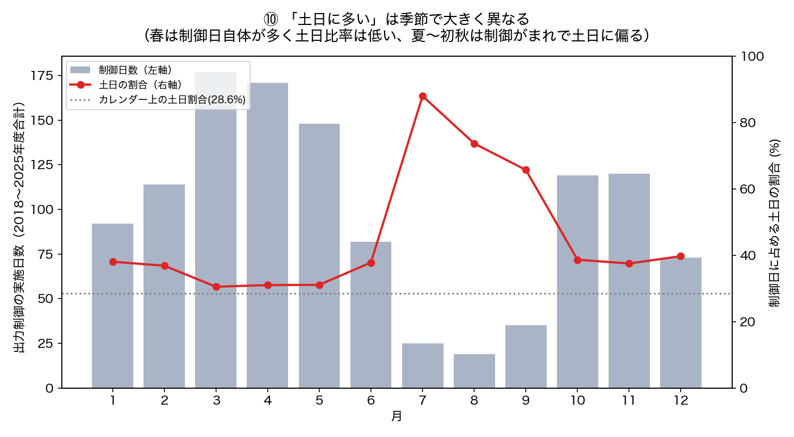
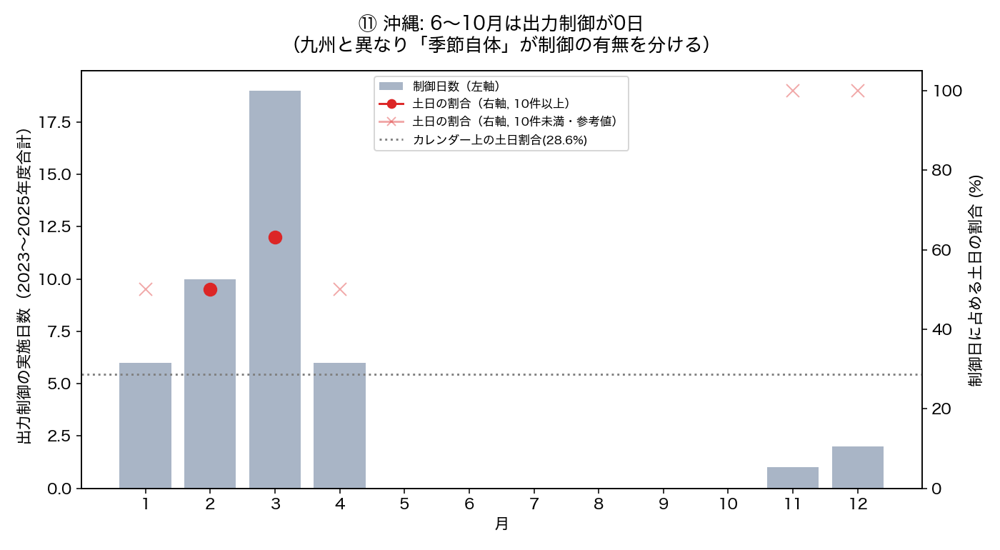
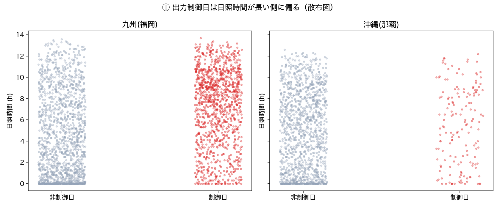
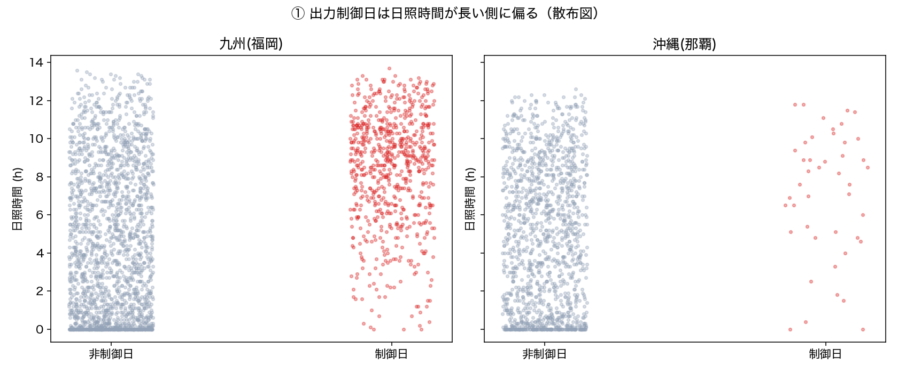
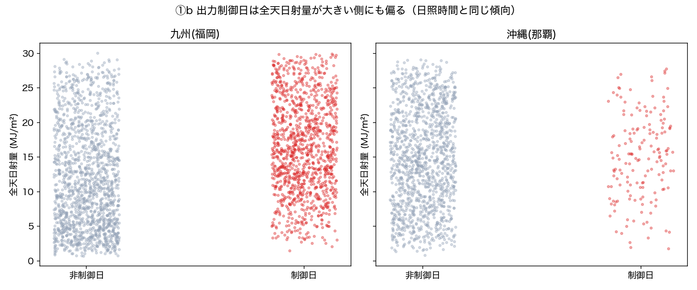
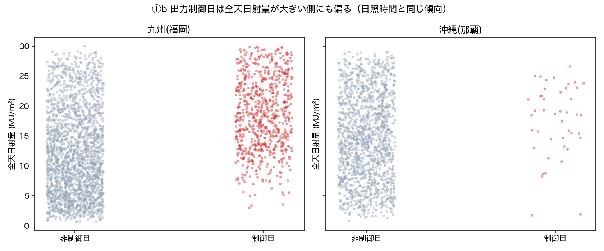

# ID-01 検証の訂正履歴 — ユーザーの「ツッコミ」が分析を正した記録

**[← README.md](README.md)**・[REPORT.md](REPORT.md)

このスパイクは、ユーザーからの**疑問・指摘を受けるたびに分析が訂正され、精度が上がっていった**。
もし質問が無ければ、間違った/粗いまま「結論」として残っていた箇所が複数ある。この経緯自体が
「データ分析は一度作って終わりではなく、疑問を持たれるたびに検証し直すべき」という教材的な価値を
持つため、何を・なぜ・どう直したかを時系列で記録する。

## 訂正一覧

| # | ユーザーの指摘・質問 | 当初の状態（問題点） | 調査・対応 | 結果・インパクト |
|---|---|---|---|---|
| 1 | 「日照時間よりは、全天日射量の方が発電量との相関が良いが、日射量でも調べた？」 | 出力制御の判別力（二値）しか見ておらず、全天日射量を試していなかった | 全天日射量でもCohen's dを計算 | 出力制御の**判別**には日照時間の方が強いという逆の結果に。後に「発電量（連続量）」では全天日射量が強いことが判明し、**目的変数で最適指標が違う**という発見につながった（#5と対になる） |
| 2 | 「amgsdsの日照時間は快晴などのときに、予測が過少になる傾向があるため、気象庁の天気予報より精度が良いかはわからない。過去の出力制御時のデータで検証できるか？」 | 「AMGSDSの方が気象庁予報より正確」と断定していた（過去日付のAPI応答が実況＝解析値であり予報ではないことに気づかず検証） | 過去日付の問い合わせが実況を返すだけと判明し検証方法自体を訂正。`ml_forecast`の既存の実測検証（予報vintageデータ）を調べ直した | **「AMGSDSの方が正確」は誤りと判明**。快晴日に-5h前後の系統的な過少評価があり、優劣はつけられないと訂正 |
| 3 | 「ml-forcastにある沖縄の日照時間の予報がある期間で...出力制御関連の検証はできるか」 | （検証を試みる前） | AMGSDS予報vintageアーカイブ（2026年5月〜）と沖縄の出力制御データ（〜2026年3月）の期間を確認 | **重複期間が無く検証不可能**と判明。無理に結論を出さず「今はできない」と明記する判断に |
| 4 | 「出力制御日は土日に多いというのは、季節による変動はないのか？」 | 「土日の割合37.4%」を季節を区別せず一つの数字として結論づけていた | 月別に出力制御日数・土日比率を集計 | **季節で全く逆の2パターンが混在**（春=頻発・曜日差小、夏〜初秋=希少・土日に極端に偏る）と判明。ロジスティック回帰に月を特徴量として追加する着想につながった（#6） |
| 5 | （上記#4の指摘を受けた追加確認）「reportの図も季節別の分析に対応させて変更した？まとめも。」 | 季節変動を文章では記録したが、既存の図（曜日別割合）・ロジスティック回帰モデル・まとめ表には未反映のまま放置していた | 月をダミー変数としてロジスティック回帰に実際に追加して再学習 | AUCが0.669→0.852（後に訂正でさらに変化）に大幅改善。**季節が日照時間・曜日より強力な予測因子**と判明。「書いたら即モデルに反映する」ことの重要性を再確認 |
| 6 | 「6.実際の発電量との精度比較は風力も入れているが日射量とは関係ない。太陽光のみのデータはないのか？」 | 「エリア風力・太陽光発電量」の合計を使い、太陽光単独の相関として報告していた | 太陽光単独の実績データ（旧形式+新形式を接続）を新たに取得 | 相関がさらに強まり（全天日射量r=0.819→0.835等）、結論の方向は変わらなかったが**データの正確性が向上** |
| 7 | 「太陽光発電量は、電力会社が太陽光発電の電力を買った量？」 | 「発電量」という言葉を無頓着に使っていた（パネルの発電能力と誤解されうる） | データの出典（系統情報公表の考え方）を確認し定義を明記 | 「系統に実際に流れ込んだ出力」である旨をREADME・REPORT・コードのdocstringに明記。**用語の誤解を防ぐドキュメント化** |
| 8 | 「⑧図の相関図がよくわからない。全天日射量が小さいところは、太陽光発電量も少ないはずで、その領域では出力制御をかけないのでは？」 | **最重要の発見**。「制御日」の判定が「前日指示（予報ベース）」列だけを読んでおり、当日の「速報（実況ベースの見直し）」を無視していた | Excel/PDFの構造を再調査し、前日は晴れ予報で指示したが当日は曇って実際には不要だった、という取り消しケースが多数存在することを実データで確認。パーサーを「速報があれば速報を優先」するロジックに修正 | **制御日数が九州1175日→715日（-39%）、沖縄160日→44日（-72.5%）に激減**。以降の全ての分析（Cohen's d、ロジスティック回帰、バックテスト、発電量相関）を再計算。信号は軒並み大幅に強くなった（九州Cohen's d 0.73→1.07、フルモデルAUC 0.852→0.904等） |

## 全体として見えること

- **#8が最大の訂正**で、以前の分析結果の土台（「どの日が制御日か」というラベル自体）が約4割間違っていた。これは統計的検定・機械学習モデルのどちらを使っても検出できない種類の誤り（データの意味の取り違え）であり、**実際のドメイン知識（「前日予報と当日実況は別物」）に基づいた疑問でしか見つからなかった**。
- #2・#8はいずれも「もっともらしい数値が出たので正しいと思い込んだ」ことが原因。#2は相関0.999という極端に良い結果を疑わなかった失敗、#8は散布図の見た目の違和感を自分では拾えなかった失敗。
- #4→#5の流れは「指摘を受けて直した（つもり）が、関連する別の場所（図・モデル）まで直し切れていなかった」という、修正の伝播漏れの典型例。
- 逆に言えば、**同じデータに対して複数の角度から疑問を持たれ続けたことで、精度が段階的に上がっていった**（Cohen's d、ロジスティック回帰AUC、発電量相関のいずれも、訂正を経るごとに「もっともらしい」だけでなく「実際に正しい」数値に近づいた）。

## 代表的な3つの例（図で見る）

### 例A: 季節による違い（#4・#5）

最初の結論は「制御日のうち土日の割合は37.4%」という季節を区別しない一つの数字だけだった。
「季節による変動はないのか？」という指摘を受けて月別に分解すると、九州・沖縄のどちらも
**正反対の2パターンが混ざっていた**とわかった（春は頻発・曜日差小、夏〜初秋は希少・土日に極端に偏る）。

### 例B: 前日指示 と 当日速報 — 日照時間の散布図（#8・最重要の訂正）

「前日指示」列だけを見て、当日の「速報」による取り消しを見落としていたバグ。前日は晴れ予報で
制御を指示したが、当日は曇って実際には不要だった、というケースを誤って「制御日」に含めていた。
修正前は制御日（赤）が日照時間の短い側にも広く散らばっていたが、修正後は晴天側にはっきり集まった。

| 訂正前 | 訂正後 |
|---|---|
|  |  |

### 例C: 前日指示 と 当日速報 — 全天日射量の散布図（#8、別指標での再確認）

同じ修正を、日照時間とは別の指標「全天日射量」でも確認した結果。日照時間（例B）と同様に、
修正でノイズ（実際には制御不要だった日）が除かれ、高日射側への偏りが明確になった。

| 訂正前 | 訂正後 |
|---|---|
|  |  |

> 📝 この①bの「訂正前」図のみ、他の図とは作り方が異なる。`data/`はgit管理外のため、バグ修正後は
> 当時（前日指示のみを見ていた頃）の制御日リストそのものは残っていない。そこでExcel/PDFの生データ
> （`data/raw/`、これはgit管理外だが当時のまま手元に残っている）から当時のロジックだけを再現し、
> 全天日射量版の散布図を新たに作成した（九州1170日/沖縄160日で、実際の当時の値1175日/160日に近い）。
> 他の「訂正前」図（①②③④⑤⑦⑧⑨⑩⑪）はgit履歴から当時のPNGそのものを復元したものであり、再現ではない。

## 訂正前後の図の比較（#8: パーサーのバグ修正）

最大の訂正（#8）について、修正前の図を [results/figs_before_correction/](results/figs_before_correction/) にgit履歴から復元して残した。現在の図（[README.md](README.md)・[REPORT.md](REPORT.md)参照）と見比べると、信号がどれだけクリアになったかが分かる。

| 図 | 訂正前 | 訂正後 |
|---|---|---|
| ①散布図（制御日の日照時間） | [figs_before_correction/01_scatter_sunshine.png](results/figs_before_correction/01_scatter_sunshine.png) | [figs/01_scatter_sunshine.png](results/figs/01_scatter_sunshine.png) |
| ①b散布図（制御日の全天日射量） | [figs_before_correction/01b_scatter_solarmj.png](results/figs_before_correction/01b_scatter_solarmj.png)（※再現図、上記注記参照） | [figs/01b_scatter_solarmj.png](results/figs/01b_scatter_solarmj.png) |
| ②年次トレンド | [figs_before_correction/02_yearly_trend.png](results/figs_before_correction/02_yearly_trend.png) | [figs/02_yearly_trend.png](results/figs/02_yearly_trend.png) |
| ③曜日別割合 | [figs_before_correction/03_weekday_ratio.png](results/figs_before_correction/03_weekday_ratio.png) | [figs/03_weekday_ratio.png](results/figs/03_weekday_ratio.png) |
| ④判別力比較（Cohen's d） | [figs_before_correction/04_discriminative_power.png](results/figs_before_correction/04_discriminative_power.png) | [figs/04_discriminative_power.png](results/figs/04_discriminative_power.png) |
| ⑤ロジスティック回帰AUC比較 | [figs_before_correction/05_auc_comparison.png](results/figs_before_correction/05_auc_comparison.png) | [figs/05_auc_comparison.png](results/figs/05_auc_comparison.png) |
| ⑦バックテスト比較 | [figs_before_correction/07_backtest_comparison.png](results/figs_before_correction/07_backtest_comparison.png) | [figs/07_backtest_comparison.png](results/figs/07_backtest_comparison.png) |
| ⑧発電量との散布図 | [figs_before_correction/08_generation_scatter.png](results/figs_before_correction/08_generation_scatter.png) | [figs/08_generation_scatter.png](results/figs/08_generation_scatter.png) |
| ⑨発電量との相関比較 | [figs_before_correction/09_generation_corr.png](results/figs_before_correction/09_generation_corr.png) | [figs/09_generation_corr.png](results/figs/09_generation_corr.png) |
| ⑩季節×曜日効果（九州） | [figs_before_correction/10_seasonal_weekday.png](results/figs_before_correction/10_seasonal_weekday.png) | [figs/10_seasonal_weekday.png](results/figs/10_seasonal_weekday.png) |
| ⑪沖縄の季節変動 | [figs_before_correction/11_okinawa_seasonal.png](results/figs_before_correction/11_okinawa_seasonal.png) | [figs/11_okinawa_seasonal.png](results/figs/11_okinawa_seasonal.png) |

主な数値の変化（訂正前→訂正後）:

| 指標 | 訂正前 | 訂正後 |
|---|---|---|
| 九州の制御日数 | 1175日 | **715日**（-39%） |
| 沖縄の制御日数 | 160日 | **44日**（-72.5%） |
| 九州 Cohen's d（日照時間、全日） | 0.73 | **1.07** |
| 沖縄 Cohen's d（日照時間、全日） | 0.16 | **0.63** |
| ロジスティック回帰フルモデル AUC | 0.852 | **0.904** |
| バックテスト（簡略化）AUC | 0.686 | 0.768 |

## 教訓（今後の分析作業への反映）

1. **散布図・生データを実際に目で見る工程を省略しない**。相関係数やAUCだけを見ていたら#8は見つからなかった。
2. **「もっともらしすぎる結果」（相関0.999等）は疑う**。綺麗すぎる結果はたいてい見ているものが違う。
3. **指摘を受けて直したら、関連する全ての図・モデル・ドキュメントへの伝播を確認する**（#4→#5のような漏れを避ける）。
4. **データの定義（何を測っているか）を最初に確認する**（#7）。「発電量」のような一見自明な言葉ほど危ない。
