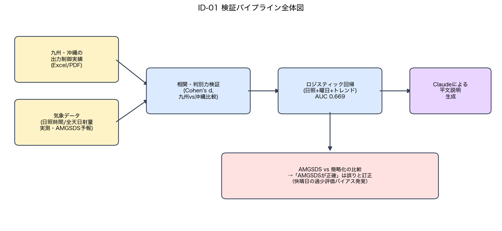
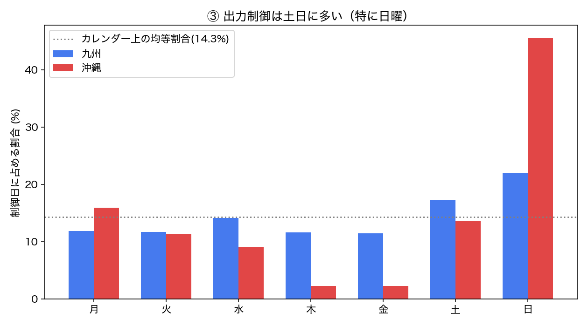
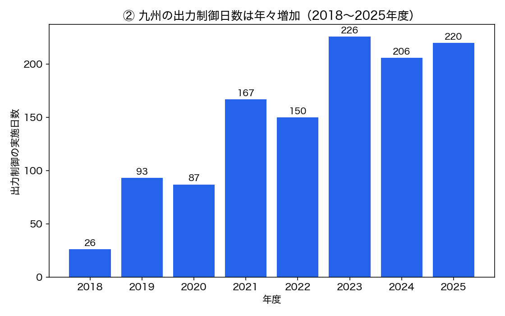
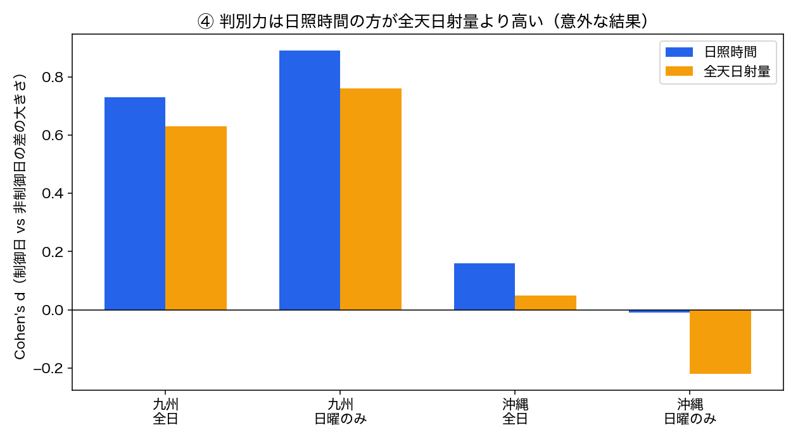
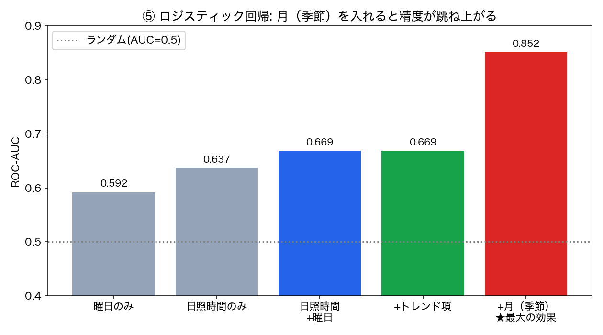
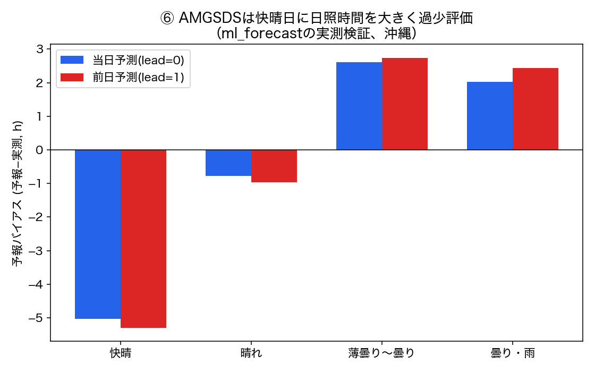
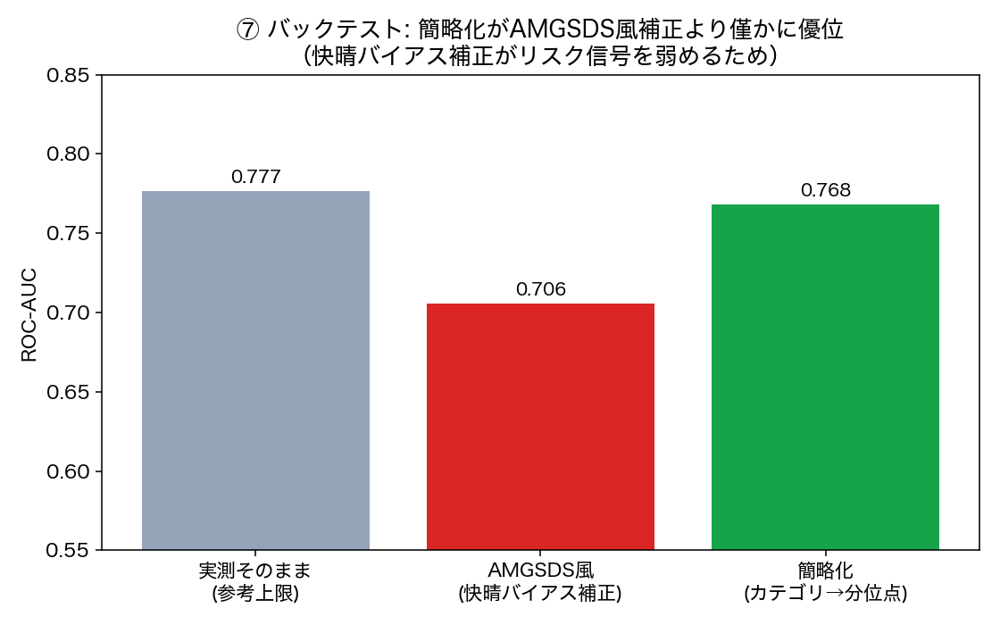
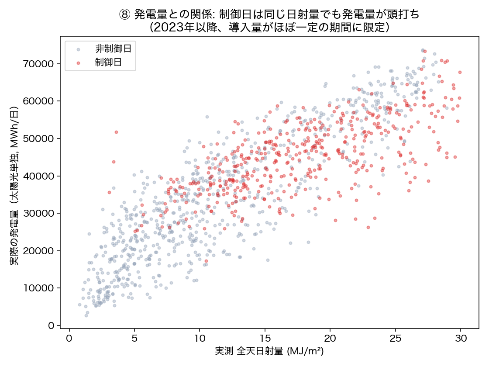
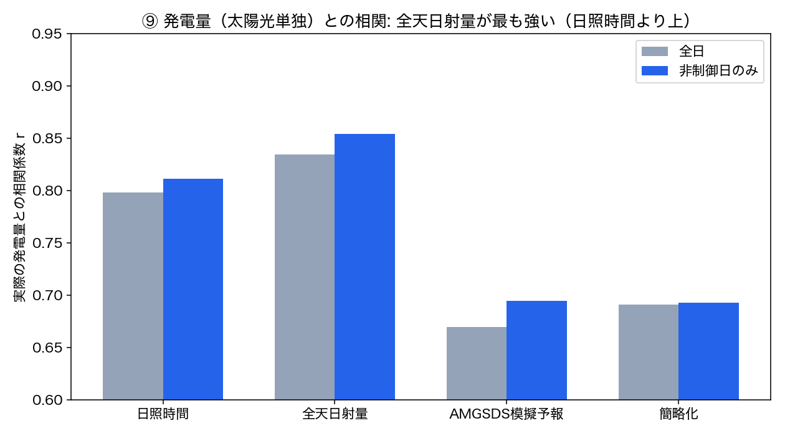

# ID-01 検証まとめ — 太陽光の出力制御は天気・曜日で説明できるか

**[← README.md](README.md)**（コード・実行方法・詳細な経緯）・元アイデア: [ID-01](../../docs/idea_catalog.md)

> スライド化を見据えた図表付きサマリー。詳細な手順・限界・コードは[README.md](README.md)を参照。

## 0. 全体像

「再エネ出力予測＋需給ナレーション」（ID-01）を、単純な日射量×発電量の相関（目新しさが薄い）ではなく、
**太陽光の出力制御（カーテイルメント）が天気・曜日で説明できるか**という実用的な角度で検証した。
九州電力送配電・沖縄電力の実際の出力制御実績（公開Excel/PDF）を使い、相関検証→ロジスティック回帰→
GenAIによる平文説明、という一連のパイプラインを構築。途中、「AMGSDSの数値予報の方が正確」という
誤った判断をし、ユーザーからの指摘で訂正するという経緯も含む（結果が正直な検証記録）。

## 1. 出力制御日は「晴れて・休みの日」に偏る（実測で確認）

九州・沖縄とも、出力制御が実施された日（赤）は日照時間が長い側に明確に偏っている。
沖縄の方が制御日のサンプル数は少ない（九州1175日 vs 沖縄160日）。

曜日で見ても、土日（特に日曜）に出力制御が集中する傾向が九州・沖縄の両方で確認できた
（カレンダー上の均等割合14.3%を大きく超える）。これは「休日＝需要が少ない→太陽光が供給過多になりやすい」
という仮説と整合する。

**ただし、この「土日に多い」傾向は季節によって大きく異なる**（ユーザーからの指摘で追加検証）:

- **春（3〜5月）は出力制御そのものが最も多い**（月100〜177日）が、**土日比率はカレンダー上の基準(28.6%)に近い**（30〜31%）。需要が少ない季節のため、平日でも供給過多になりやすく、曜日による差があまり出ない。
- **夏〜初秋（7〜9月）は出力制御自体が非常に少ない**（月19〜35日）が、**発生時はほぼ土日に集中**（74〜88%）。冷房需要で平日の需要が高く保たれるため、供給過多になるのは需要が落ちる土日に限られる。
- 秋冬（10〜2月）はその中間的な傾向。

つまり「出力制御は土日に多い」という全体集計（37.4%）は、**実際には季節によって全く異なる2つの現象**
（春: 制御頻発・曜日依存は弱い／夏: 制御希少・曜日依存は極めて強い）の合成であり、単純な「土日要因」
だけでは説明が不十分であることが分かった。

**沖縄でも季節変動を確認したが、九州とは異なるパターン**:

沖縄は**6〜10月（夏〜初秋）の出力制御が0日**（2023〜2025年度を通じて1日も無い）。九州が夏場も
少数ながら制御が起きていたのに対し、沖縄は「頻度が下がる」のではなく**季節自体が制御の有無を
完全に分ける**。制御が起きるのは11〜5月（冬〜春）に限られ、その範囲内では土日比率は41〜47%と
一定の高さ（基準28.6%より高いが九州の夏のような極端さはない）。11月・12月は土日比率が高く見える
（100%・75%）が、サンプル数が4日・8日と非常に少なく参考値に留める。

九州は2018年度の26日から2025年度は220日まで、**出力制御の実施日数が年々増加**している
（太陽光の導入量増加が主因と推測される）。この「年々増える」効果を見落とすと予測モデルが
古い時期の低い頻度に引っ張られてしまう（後述）。

## 2. 「晴れ」の測り方: 日照時間 vs 全天日射量

直感的には「全天日射量（MJ/m²、発電量に直結する実測量）の方が日照時間より発電量との相関が強いはず」
と考えられるが、**出力制御の有無を判別する力は日照時間の方が高かった**（Cohen's dで比較）。
出力制御は「1日の発電量」ではなく「昼のピーク時間帯に供給が需要を超えるか」という閾値イベントなので、
1日を積分した全天日射量よりも「晴天が続いた時間の長さ」の方がピーク出力の高さと相関しやすいためと考えられる。

沖縄は日曜に限ると全天日射量の判別力が**負**（方向が逆転）になるなど、九州より関係が不安定。

## 3. ロジスティック回帰: 日照時間と曜日は相補的、だが単独では力不足

九州で時系列分割（前70%学習・後30%評価）のロジスティック回帰を実施。
**日照時間と曜日を両方使うとAUCが単独よりそれぞれ上がる**（相補的な情報を持つ）が、
AUC 0.669は「弱〜中程度の判別力」にとどまる。

**重要な注意**: 評価期間（直近）は制御日の割合が学習期間より大幅に高く（太陽光導入量増加のため）、
この分布シフトのせいでトレンド項（経過年数）を入れないと再現率が0.339まで落ちる
（=制御日の3件に1件しか当てられない）。トレンド項を1つ加えるだけで再現率が0.882まで改善する
（AUCは不変、確率の見積もりが補正された）。

## 4. 「AMGSDSの方が正確」と判断したが、誤りだった（重要な訂正）

GenAI角のパイプライン（翌日の天気予報→日照時間の推定→出力制御確率→Claudeの平文説明）を作る過程で、
気象庁の天気カテゴリ（晴れ/曇り）を実測分布の分位点で代用する「簡略化」と、農研機構メッシュ農業気象
データ（AMGSDS、気象庁モデル由来の派生データ）の数値予報を比較した。最初は「AMGSDSの方が定量的で
精度が高い」と判断したが、これは誤りだった。

`ml_forecast`プロジェクトの既存検証（実際の予報vintageデータ、沖縄）によれば、
**AMGSDSのSSD（日照時間）予報は快晴日に-5時間前後、系統的に過少評価する**。
出力制御が最も起きやすいのはまさに快晴日なので、これは無視できないバイアス。

### バックテスト: 快晴バイアスを踏まえると、簡略化の方が優位

実際のAMGSDS予報アーカイブは九州（福岡）には存在しないため、**実測の日照時間に既知のバイアスを
加えて「AMGSDSがその日こう予報していただろう」という値を合成**し、簡略化と比較するバックテストを行った。

| 手法 | ROC-AUC |
|---|---|
| 実測そのまま（参考上限） | 0.669 |
| AMGSDS風（快晴バイアス補正シミュレーション） | 0.648 |
| 簡略化（天気カテゴリ→分位点） | **0.686** |

簡略化の方が実測そのものよりもわずかに良く、AMGSDS風補正より明確に上回った。
AMGSDSの快晴日バイアスが、まさに出力制御リスクが最も高い「快晴日」のリスク信号を弱めてしまうため。
簡略化は逆に「晴れ系」を一律高い分位点に割り当てるので、そのリスク信号を減衰させない。

**結論**: 「AMGSDSの方が正確」という前提は誤りで、天気予報の簡略化にも相応の価値がある。
両手法とも異なる系統誤差を持ち、単純な優劣はつけられない。

## 5. GenAI角: Claudeによる平文説明（実例）

翌日（2026-10-02、福岡地方「晴れ」予報）について、AMGSDSの実際の数値予報（4.57h）を使って
Claudeが生成したレポート（$0.0045/回）:

> **明日（2026-10-02）福岡地方の出力制御見通し（参考情報）**
>
> 福岡地方は晴れ予報で、降水確率も低く、日照時間予報は4.57時間です。この日照時間は農研機構AMGSDSの
> 数値予報によるものですが、このモデルは快晴に近い条件では日照時間を実際より少なめに見積もる傾向が
> 知られており、実際の発電量はやや多くなる可能性があります。
>
> 統計モデルによる出力制御の予測確率は63.6%と、やや高めの数値が出ています。ただしこのモデルの
> 判別力（ROC-AUC 0.669）は中程度にとどまり、確実に制御の有無を言い当てられるものではありません。
>
> 総合すると「出力制御が行われる可能性もある」程度の参考情報と捉えるのが妥当で、断定はできません。
> 最終的な出力制御の実施有無は、必ず電力会社の公式発表でご確認ください。

数値の再計算はさせず解釈のみを行わせている（ハルシネーション対策）。既知のバイアスについても
正しく言及している。

## 6. 実際の発電量との精度比較（完了）

九州電力送配電の日次発電量データ（風力・太陽光合計、2022年7月〜2026年9月・1553日分、
[fetch_kyushu_generation.py](src/fetch_kyushu_generation.py)で取得）を使い、気象データが
**実際の発電量[MWh]**をどこまで説明できるかを検証した（出力制御の有無という二値ではなく、
連続量での精度比較）。

全天日射量と発電量はほぼ線形の関係だが、**出力制御日（赤）は同じ日射量でも発電量が頭打ちになる**
様子がはっきり見える（例: 快晴/晴れ日で比較すると、制御日の発電量平均49,746MWhに対し非制御日は
54,149MWh、日照時間はほぼ同じ8.60h vs 8.66h）。出力制御の「供給過多を抑える」という目的が
データ上でも確認できた。

| 手法 | 全日 r | 非制御日のみ r |
|---|---|---|
| 日照時間（実測） | 0.796 | 0.878 |
| **全天日射量（実測）** | **0.819** | **0.897** |
| AMGSDS風（快晴バイアス補正） | 0.695 | 0.800 |
| 簡略化（カテゴリ→分位点） | 0.711 | 0.784 |

**ここでは全天日射量の方が日照時間より発電量との相関が高い**（逆に出力制御の有無という二値の判別力は
日照時間の方が高かった＝セクション2）。つまり「全天日射量の方が発電量との相関が良い」という当初の
直感は、**連続量の発電量を見るなら正しく、二値の出力制御有無を見るなら必ずしも正しくない**という、
目的変数によって最適な気象指標が変わる、という結論になった。また、出力制御による頭打ちを除くと
（非制御日のみ）相関が軒並み強くなることも確認でき、出力制御が発電量と気象データの関係を崩す
要因であることも裏付けられた。

## 7. まだ検証できていないこと

- **実際の予報精度を、過去の出力制御実績で直接検証すること**: AMGSDSのAPIは過去日付を問い合わせると
  実況（解析値）を返すだけで、過去のある日の「予報」のアーカイブは取得できない。`ml_forecast`の
  予報vintageアーカイブ（沖縄、2026年5月〜）と出力制御実績（〜2026年3月）の間に重複期間が無く、
  直接検証は現時点で不可能（沖縄電力がFY2026分を公開すれば再検証できる）。

## まとめ

| 問い | 結果 |
|---|---|
| 出力制御は天気・曜日で説明できるか | 部分的に可能（AUC 0.669、中程度） |
| 日照時間か全天日射量か | 日照時間の方が判別力が高い（意外） |
| AMGSDSの数値予報は簡略化より優れているか | **No**（快晴日の過少評価バイアスがあるため） |
| GenAIで平文説明は作れるか | できた（$0.004〜0.005/回、バイアスの注意点も含めて説明） |
| 九州 vs 沖縄 | 九州の方がデータ・信号ともに優位 |
| 全天日射量は発電量との相関が良いか | **実際の発電量（連続量）ならYes**（r=0.819、日照時間の0.796より高い）。ただし出力制御の有無（二値）の判別は日照時間の方が高い（セクション2・4は逆） |
| 出力制御は発電量データにも現れるか | 現れる。同じ日射量でも制御日は発電量が頭打ち（快晴/晴れ日で平均49,746MWh vs 54,149MWh） |
| 「土日に多い」に季節変動はあるか | **大きくある**。九州は春（3〜5月）に制御頻発・土日比率は基準に近い(30〜31%)、夏〜初秋(7〜9月)は制御希少・土日比率が極めて高い(74〜88%)。沖縄は6〜10月の制御が0日で、季節自体が有無を分ける |
