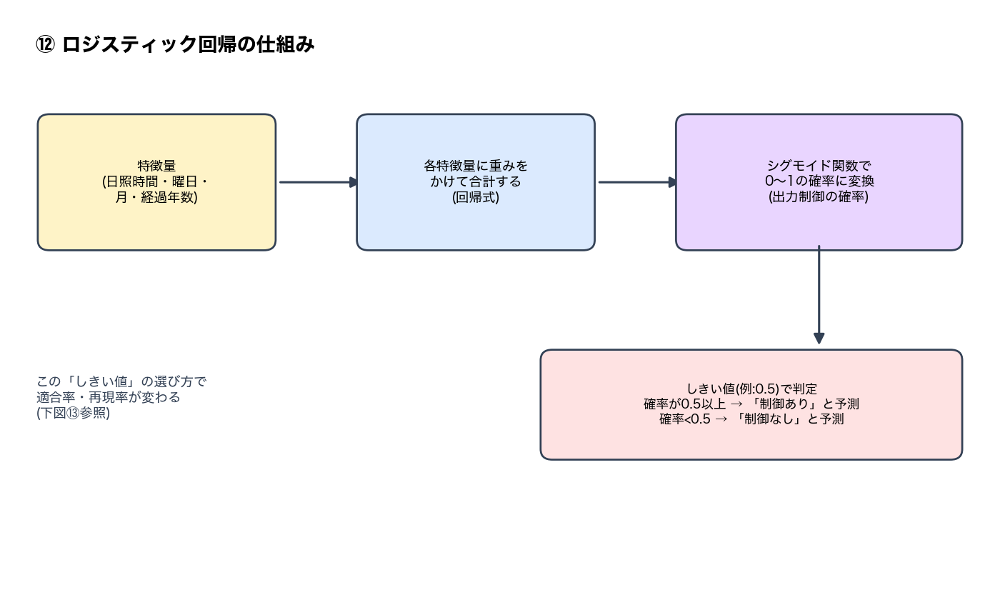
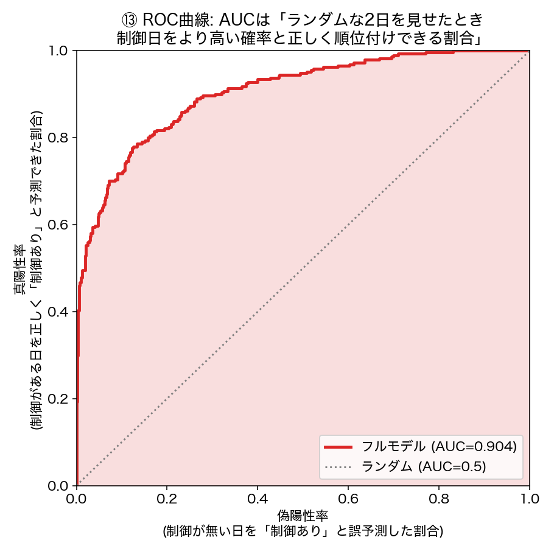

# ID-01 検証まとめ — 太陽光の出力制御は天気・曜日で説明できるか

**[← README.md](README.md)**（コード・実行方法・詳細な経緯）・元アイデア: [ID-01](../../docs/idea_catalog.md)

> スライド化を見据えた図表付きサマリー。詳細な手順・限界・コードは[README.md](README.md)を参照。
> ユーザーの指摘で分析が訂正されていった過程（訂正前後の図の比較つき）は[CORRECTIONS_LOG.md](CORRECTIONS_LOG.md)を参照。

## 0. 全体像

「再エネ出力予測＋需給ナレーション」（ID-01）を、単純な日射量×発電量の相関（目新しさが薄い）ではなく、
**太陽光の出力制御（カーテイルメント）が天気・曜日で説明できるか**という実用的な角度で検証した。
九州電力送配電・沖縄電力の実際の出力制御実績（公開Excel/PDF）を使い、相関検証→ロジスティック回帰→
Claudeによる平文説明、という一連のパイプラインを構築。

途中、2つの大きな誤りをユーザーの指摘で発見・訂正している（結果が正直な検証記録）:
1. 「AMGSDSの数値予報の方が正確」という誤った判断（セクション4）
2. **「制御日」のラベル自体の約4割が誤りだった**（前日の予報に基づく指示だけを見ており、当日の
   実況に基づく取り消しを見逃していた。本レポートの数値は全てこの訂正を反映済み。経緯は
   [CORRECTIONS_LOG.md](CORRECTIONS_LOG.md)、訂正前後の図の比較も掲載）

## 0.5 分析手法の解説（用語集）

本レポートで繰り返し出てくる統計手法・指標を先にまとめて説明する。

### ロジスティック回帰

「日照時間が長いか」「土日か」「何月か」などの特徴量から、「その日に出力制御が起きるかどうか」
を**確率**（0〜1）で予測する手法。

予測した確率に対して「しきい値」（通常0.5）を決め、それ以上なら「制御あり」、それ未満なら
「制御なし」と判定する。このしきい値の選び方次第で、後述の「適合率」「再現率」の数値が変わる
（しきい値を下げれば再現率は上がるが適合率は下がる、というトレードオフがある）。

### ROC-AUC（判別力の指標）

ROC-AUCは「しきい値を変えながら全パターンを試したときの、モデルの総合的な判別力」を表す
0〜1の指標。**直感的な意味は「ランダムに『制御があった日』と『制御がなかった日』を1日ずつ
見せたとき、モデルが正しく『制御があった方が確率が高い』と順位付けできる割合」**。
- AUC = 0.5 → ランダム予測と同じ（当てずっぽう）
- AUC = 1.0 → 完全に正しく順位付けできる
- 本レポートで繰り返し出てくる「AUC 0.777」「AUC 0.904」等はこの指標。0.904なら
  「ランダムな2日を比べたとき約90%の確率で正しく順位付けできる」という意味になる。

### 適合率（Precision）と再現率（Recall）

しきい値を決めて実際に「制御あり」と予測した後の精度を見る2つの指標（どちらもトレードオフの関係）。
- **適合率**: モデルが「制御あり」と予測した日のうち、実際に制御があった日の割合（予測の「的中率」）
- **再現率**: 実際に制御があった日のうち、モデルが「制御あり」と予測できた日の割合（「見逃し」の少なさ）
- 本レポートの「見落とすと再現率が落ちる」という表現は、モデルが確率を低く見積もりすぎて
  しきい値0.5を超えず「制御なし」と誤判定してしまうケースが増えることを指す。

### Cohen's d（効果量）

2つのグループ（例: 制御日と非制御日）の平均値の差が、データのばらつき（標準偏差）に比べて
どれくらい大きいかを表す指標。単位が付かないので、異なる指標（日照時間 vs 全天日射量など）の
「差の大きさ」を公平に比較できる。目安: 0.2=小さい、0.5=中程度、0.8以上=大きい。

### 相関係数 r

2つの連続的な数値（例: 全天日射量と発電量）がどれくらい一直線に近い関係にあるかを表す
-1〜1の指標。1に近いほど「片方が増えるともう片方も増える」という関係が強い。

## 1. 出力制御日は「晴れて・休みの日」に偏る（実測で確認）

九州・沖縄とも、出力制御が実施された日（赤）は日照時間が長い側に明確に偏っている。
沖縄の方が制御日のサンプル数は少ない（九州715日 vs 沖縄44日）。

曜日で見ても、土日（特に日曜）に出力制御が集中する傾向が九州・沖縄の両方で確認できた
（カレンダー上の均等割合14.3%を大きく超える）。これは「休日＝需要が少ない→太陽光が供給過多になりやすい」
という仮説と整合する。**ただしこの図は年間を通じた集計であり、実際には季節で全く異なる2つの
パターンが混ざっている**（次の段落で詳述。後述のロジスティック回帰でも月を入れるとAUCが
大きく改善することから、この図だけでは季節の効果を捉えきれていないことが裏付けられる）。

- **春（3〜5月）は出力制御そのものが最も多い**（月113〜143日）が、**土日比率はカレンダー上の基準(28.6%)に近い**（29〜34%）。需要が少ない季節のため、平日でも供給過多になりやすく、曜日による差があまり出ない。
- **夏〜初秋（7〜9月）は出力制御自体が非常に少ない**（月2〜18日、7・8月はn=2〜3と極めて少数のため参考値）が、**発生時はほぼ土日に集中**（83〜100%）。冷房需要で平日の需要が高く保たれるため、供給過多になるのは需要が落ちる土日に限られる。
- 秋冬（10〜2月）はその中間的な傾向。

つまり「出力制御は土日に多い」という全体集計（39.2%）は、**実際には季節によって全く異なる2つの現象**
（春: 制御頻発・曜日依存は弱い／夏: 制御希少・曜日依存は極めて強い）の合成であり、単純な「土日要因」
だけでは説明が不十分であることが分かった。

**沖縄でも季節変動を確認したが、九州とは異なるパターン**:

沖縄は**5〜10月（初夏〜初秋）の出力制御が0日**（2022〜2025年度を通じて1日も無い）。九州が夏場も
少数ながら制御が起きていたのに対し、沖縄は「頻度が下がる」のではなく**季節自体が制御の有無を
完全に分ける**。制御が起きるのは11〜4月（冬〜春）に限られ、その範囲内（1〜4月）では土日比率は
50〜63%と高め。11月・12月は土日比率がさらに高く見える（100%）が、サンプル数が1日・2日と極めて
少なく参考値に留める。

九州は2018年度の26日から2023年度に136日まで増加し、以降は128〜136日前後で推移している
（太陽光の導入量増加が主因と推測されるが、2023年度以降は頭打ちの様子もうかがえる）。この
年度による頻度の違いを見落とすと予測モデルが古い時期の低い頻度に引っ張られてしまう（後述）。

## 2. 「晴れ」の測り方: 日照時間 vs 全天日射量

直感的には「全天日射量（MJ/m²、発電量に直結する実測量）の方が日照時間より発電量との相関が強いはず」
と考えられるが、**出力制御の有無を判別する力は日照時間の方が高かった**（Cohen's dで比較）。
出力制御は「1日の発電量」ではなく「昼のピーク時間帯に供給が需要を超えるか」という閾値イベントなので、
1日を積分した全天日射量よりも「晴天が続いた時間の長さ」の方がピーク出力の高さと相関しやすいためと考えられる。

沖縄は日曜に限ると全天日射量の判別力が**負**（方向が逆転）になるなど、九州より関係が不安定。

## 3. ロジスティック回帰: 日照時間と曜日は相補的、だが単独では力不足

九州で時系列分割（前70%学習・後30%評価）のロジスティック回帰を実施。
**日照時間と曜日を両方使うとAUCが単独よりそれぞれ上がる**（相補的な情報を持つ）が、
AUC 0.777は「中〜高程度の判別力」にとどまる。

**重要な注意**: 評価期間（直近）は制御日の割合が学習期間より大幅に高く（太陽光導入量増加のため）、
この分布シフトのせいでトレンド項（経過年数）を入れないと再現率が0.241まで落ちる。
トレンド項を1つ加えるだけで再現率が0.515まで改善する
（AUCは不変、確率の見積もりが補正された）。

**さらに重要な追加発見**: 上記セクション1で見た「季節による大きな違い」を特徴量に加えると、
AUCが0.777→**0.904**まで跳ね上がった（グラフの赤バー）。**季節（月）は
日照時間・曜日のどちらにも匹敵する強力な予測因子だった**。分解すると:

| 特徴量の組み合わせ | AUC | 適合率 | 再現率 |
|---|---|---|---|
| 日照時間+曜日+トレンド（月無し） | 0.777 | 0.591 | 0.515 |
| 月のみ+トレンド | 0.763 | 0.586 | 0.612 |
| 月+曜日+トレンド | 0.779 | 0.625 | 0.636 |
| 月+日照+トレンド | 0.894 | 0.796 | 0.766 |
| **月+日照+曜日+トレンド（フル）** | **0.904** | 0.774 | 0.777 |

月を入れた上でも日照時間・曜日はそれぞれ追加の情報を持つ（フルモデルが最良）が、**内訳を見ると
「月+日照」の組み合わせ（0.894）が「月+曜日」（0.779）や「月のみ」（0.763）を大きく上回っており、
月と日照時間を組み合わせることが特に効果的**だと分かる。曜日（土日祝）を加える効果は相対的に小さい
（0.894→0.904への改善のみ）。これはセクション1で見たように、曜日効果自体が季節によって正反対の
振る舞いをするため、「曜日」という単純な二値情報だけでは季節内の違いまでは説明しきれないため。

## 4. 「AMGSDSの方が正確」と判断したが、誤りだった（重要な訂正）

Claudeによる需給ナレーション生成のパイプライン（翌日の天気予報→日照時間の推定→出力制御確率→Claudeの平文説明）を作る過程で、
気象庁の天気カテゴリ（晴れ/曇り）を実測分布の分位点で代用する「簡略化」と、農研機構メッシュ農業気象
データ（AMGSDS、気象庁モデル由来の派生データ）の数値予報を比較した。最初は「AMGSDSの方が定量的で
精度が高い」と判断したが、これは誤りだった。

`ml_forecast`プロジェクトの既存検証（実際の予報vintageデータ、沖縄）によれば、
**AMGSDSのSSD（日照時間）予報は快晴日に-5時間前後、系統的に過少評価する**。
出力制御が最も起きやすいのはまさに快晴日なので、これは無視できないバイアス。

### バックテスト: 快晴バイアスを踏まえると、簡略化の方が優位

実際のAMGSDS予報アーカイブは九州（福岡）には存在しないため、**実測の日照時間に既知のバイアスを
加えて「AMGSDSがその日こう予報していただろう」という値を合成**し、簡略化と比較するバックテストを行った。

| 手法 | ROC-AUC |
|---|---|
| 実測そのまま（参考上限） | 0.777 |
| AMGSDS風（快晴バイアス補正シミュレーション） | 0.706 |
| 簡略化（天気カテゴリ→分位点） | **0.768** |

簡略化の方が実測そのものよりもわずかに良く、AMGSDS風補正より明確に上回った。
AMGSDSの快晴日バイアスが、まさに出力制御リスクが最も高い「快晴日」のリスク信号を弱めてしまうため。
簡略化は逆に「晴れ系」を一律高い分位点に割り当てるので、そのリスク信号を減衰させない。

**結論**: 「AMGSDSの方が正確」という前提は誤りで、天気予報の簡略化にも相応の価値がある。
両手法とも異なる系統誤差を持ち、単純な優劣はつけられない。

## 5. Claudeによる需給ナレーション生成（実例）

> 「需給ナレーション」はID-01の元案（予測結果から需給状況のひとことレポートを自動生成する、という
> 生成AIの使いどころ。[docs/idea_catalog.md](../../docs/idea_catalog.md)のID-01参照）に由来する呼び方。

翌日（2026-10-02、福岡地方「晴れ」予報）について、AMGSDSの実際の数値予報（4.57h）を使って
Claudeが生成したレポート（$0.0043/回）:

> **明日の出力制御見通し**
>
> 明日（10/2）は福岡地方で晴れ予報、降水確率も低く、日照時間は4.57時間と予測されています。
> 統計モデルによる出力制御の予測確率は約24%で、数値上は「可能性は比較的低め」と読めます。
>
> ただし以下の点にご留意ください。
> - 日照時間は農研機構AMGSDSの数値予報によるものですが、このモデルは快晴に近い好天時に日照時間を
>   少なめに見積もる傾向が知られており、実際の予測確率はさらに低めに出ている可能性があります。
> - 本モデルの判別力はROC-AUC 0.777で中〜高程度であり、絶対確実な予測ではありません。
> - 出力制御の実施・非実施は電力会社の公式発表に基づくため、本情報は参考値としてご活用ください。

数値の再計算はさせず解釈のみを行わせている（ハルシネーション対策）。既知のバイアスについても
正しく言及している。

## 6. 実際の発電量との精度比較（完了、太陽光単独データに訂正済み）

> **「発電量」の意味に注意**: ここでの「太陽光実績」は発電パネルが作った電力の総量ではなく、
> **系統（電力網）に実際に流れ込んだ太陽光の出力**（九州電力送配電の需給実績公表、系統運用のための
> 数値）。出力制御で発電を止めるとこの値自体が下がる。「発電量」ではなく「系統への出力」と読むのが正確。

九州電力送配電の日次発電量データを使い、気象データが**実際の発電量[MWh]**をどこまで説明できるかを
検証した（出力制御の有無という二値ではなく、連続量での精度比較）。**当初は「エリア風力・太陽光発電量」
の合計（2022年7月〜）しか取得できていなかったが、風力は日射と無関係なので太陽光単独の相関を見るには
不十分とのユーザーからの指摘を受け、太陽光単独の実績（旧形式+新形式を接続し2018年10月〜2026年9月の
全期間で取得、[fetch_kyushu_solar_only.py](src/fetch_kyushu_solar_only.py)）に切り替えた**。

全天日射量と発電量はほぼ線形の関係だが、**出力制御日（赤）は同じ日射量でも発電量が頭打ちになる**
様子がはっきり見える（2023年以降・太陽光導入量がほぼ一定の期間に限定。快晴/晴れ日で比較すると、
制御日の発電量平均46,614MWhに対し非制御日は49,307MWh、日照時間はほぼ同じ8.94h vs 8.38h）。
出力制御の「供給過多を抑える」という目的がデータ上でも確認できた。
**全期間(2018-2026)で単純比較すると、太陽光の導入量が年々増えているため「制御日の方が発電量が多い」
という逆転した結果になる**（導入量が違う年を混ぜて比較してしまうため）。期間を揃えることが重要。

| 手法 | 全日 r | 非制御日のみ r |
|---|---|---|
| 日照時間（実測） | 0.799 | 0.811 |
| **全天日射量（実測）** | **0.835** | **0.854** |
| AMGSDS風（快晴バイアス補正） | 0.670 | 0.695 |
| 簡略化（カテゴリ→分位点） | 0.691 | 0.693 |

（参考: 風力を含む合計データで同じ比較をすると、相関はどの指標でもやや弱まる——日照時間
r=0.796、全天日射量r=0.819（2022年7月〜のみ）。風力という無関係な変数が混ざるとノイズになる。）

**ここでは全天日射量の方が日照時間より発電量との相関が高い**（逆に出力制御の有無という二値の判別力は
日照時間の方が高かった＝セクション2）。つまり「全天日射量の方が発電量との相関が良い」という当初の
直感は、**連続量の発電量を見るなら正しく、二値の出力制御有無を見るなら必ずしも正しくない**という、
目的変数によって最適な気象指標が変わる、という結論になった。また、出力制御による頭打ちを除くと
（非制御日のみ）相関が軒並み強くなることも確認でき、出力制御が発電量と気象データの関係を崩す
要因であることも裏付けられた。

## 7. まだ検証できていないこと

- **実際の予報精度を、過去の出力制御実績で直接検証すること**: AMGSDSのAPIは過去日付を問い合わせると
  実況（解析値）を返すだけで、過去のある日の「予報」のアーカイブは取得できない。`ml_forecast`の
  予報vintageアーカイブ（沖縄、2026年5月〜）と出力制御実績（〜2026年3月）の間に重複期間が無く、
  直接検証は現時点で不可能（沖縄電力がFY2026分を公開すれば再検証できる）。

## まとめ

| 問い | 結果 |
|---|---|
| 出力制御は天気・曜日で説明できるか | 天気・曜日だけでは中〜高程度（AUC 0.777）。**月（季節）を加えるとAUC 0.904まで改善**——季節は日照時間・曜日に匹敵する強力な予測因子 |
| 日照時間か全天日射量か | 出力制御の判別（二値）には日照時間の方が高い（意外）。発電量との相関（連続量）には全天日射量の方が高い |
| AMGSDSの数値予報は簡略化より優れているか | **No**（快晴日の過少評価バイアスがあるため） |
| GenAIで平文説明は作れるか | できた（$0.004〜0.005/回、バイアスの注意点も含めて説明） |
| 九州 vs 沖縄 | 九州の方がデータ・信号ともに優位 |
| 全天日射量は発電量との相関が良いか | **太陽光単独データならYes**（r=0.835、日照時間の0.799より高い）。ただし出力制御の有無（二値）の判別は日照時間の方が高い（セクション2・4は逆） |
| 風力を含む合計データで見ても良いか | **No**（ユーザーの指摘で訂正）。風力は日射と無関係なノイズになり、相関がどの指標でも弱まる。太陽光単独に切り替えて検証 |
| 出力制御は発電量データにも現れるか | 現れる（導入量がほぼ一定の2023年以降で比較）。同じ日射量でも制御日は発電量が頭打ち（快晴/晴れ日で平均46,614MWh vs 49,307MWh）。**全期間で単純比較すると導入量増加の影響で逆転するので要注意** |
| 「土日に多い」に季節変動はあるか | **大きくある**。九州は春（3〜5月）に制御頻発・土日比率は基準に近い(29〜34%)、夏〜初秋(7〜9月)は制御希少・土日比率が極めて高い(83〜100%、n小)。沖縄は5〜10月の制御が0日で、季節自体が有無を分ける |
| 出力制御日の判定は正確だったか | **いいえ、重大なバグがあった**。前日の予報に基づく指示だけを見ており、当日の実況に基づく取り消しを見逃していた。修正後は制御日数が九州1175→715日、沖縄160→44日に減り、**信号は軒並み強くなった**（経緯は[CORRECTIONS_LOG.md](CORRECTIONS_LOG.md)） |
