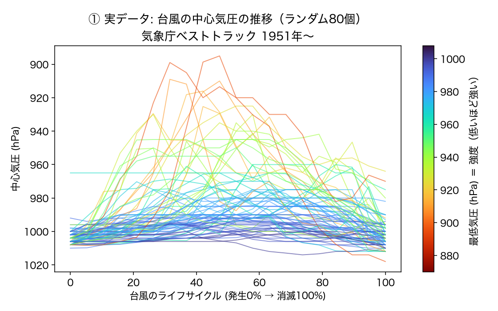
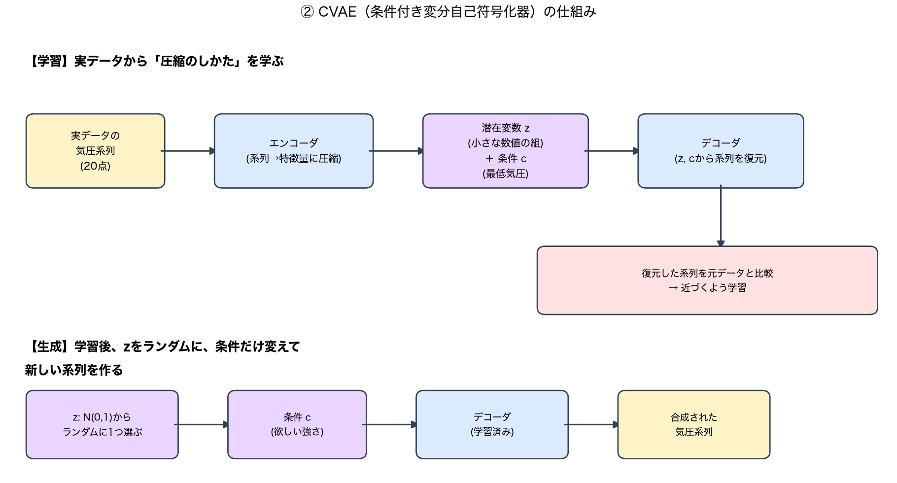
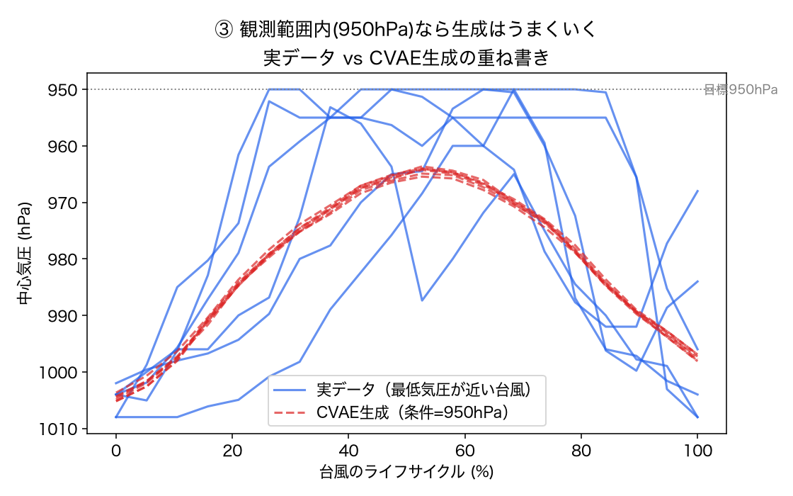
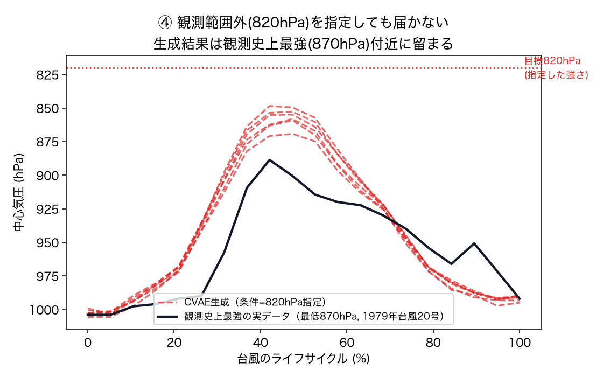
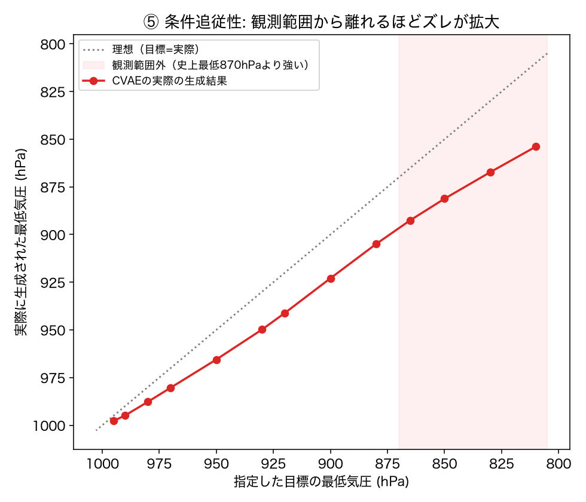
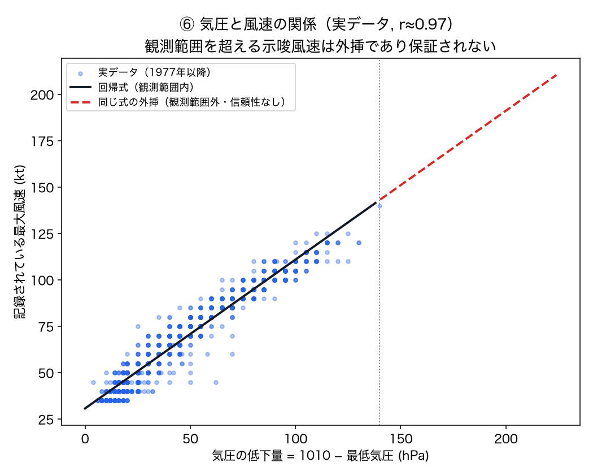

# ID-35 スパイク: 極端気象の合成データ生成（台風の強度・進路）

**[← experiments/](../README.md)** ・ 元アイデア: [ID-35](../../docs/idea_catalog.md)

条件付きVAE（Conditional VAE）で気象庁の台風ベストトラック（中心気圧の時系列）を学習し、
「観測史上よりもっと強い台風」を合成できるかを検証したスパイク。

## 結論（先に）

| 問い | 結果 |
|---|---|
| 気象庁の構造化データ（ベストトラック）だけで学習データを作れるか | **できた**。1951年〜現在・1959台風・71,421観測点を取得。台風ごとに中心気圧をライフサイクル比率（発生0%→消滅100%）で20点にリサンプリングして学習データ化 |
| 条件付きVAEで「指定した強度」の台風を合成できるか | **一部GO**。観測範囲内（970〜990hPa程度）は誤差数hPaで追従するが、条件が観測範囲から離れるほどズレが単調に拡大する（940hPa指定で+20hPa、820hPa指定で+34hPa）。**観測史上最低(870hPa)を大きく下回る「もっと強い」シナリオは、指定した通りには生成できない**（この構成のCVAEは学習データの外への外挿にバイアスがかかる） |
| 生成されたシナリオは物理的に整合しているか | **観測範囲内は整合、範囲外は未検証**。気圧-風速の関係は実データで強い相関（r≈0.97、`wind_kt = 0.80*(1010-pressure) + 30.8`）を確認できたが、観測データの範囲（気圧差4〜140hPa相当、870hPa以降）を超える示唆風速は回帰の外挿であり信頼性は保証されない |
| 「生成シナリオの説明・妥当性チェックのレポート」（GenAI角）は作れるか | **できた**。検証結果（数値のみ）をClaude（テキストのみ、$0.006〜0.007/回）に渡し、「このシナリオはどこまで信用できるか」を防災担当者向けの平文で説明させることに成功。数値の再計算はさせず解釈のみを行わせている（ハルシネーション対策） |
| GO/NO-GO | **一部GO**。データ取得・学習・生成・妥当性チェック・平文説明まで一通り機械的に動くが、「もっと強い台風」を作るという当初の狙い自体は、この単純なCVAE構成では実現できていない（下記「限界」） |

## 図解: 何をして、何がわかったか

数値だけの上表だと分かりにくいので、図で説明する。

### そもそも何をしたか（3行で）

1. 気象庁の台風データ（1951年〜、1959個の台風）から、台風ごとの「気圧の上がり下がり」を取り出した。
2. それをAI（CVAEというモデル）に学習させ、「もっと強い台風」を人工的に作ってみた。
3. できた人工データが「信用できるか」を検証し、Claudeに解説文を書かせた。

### ① まず元データはどんな形か



台風は生まれたときは気圧1000hPa前後（弱い）で、発達すると気圧がぐっと下がり（強くなる）、
弱まるとまた1000hPa近くに戻って消える。この「谷型」の形を、80個の実例を重ねて描いたのが上の図。
色が赤いほど「その台風が最も強かったとき」の気圧が低い（＝強い台風）。

**AIに学習させたのは、この「谷型カーブの形」そのもの。**

### ② CVAE（今回使ったAI）の仕組み



CVAE（Conditional VAE、条件付き変分自己符号化器）は、ざっくり言うと
**「たくさんの実例を見て、その形の作り方を圧縮して覚えるAI」**。

- **学習時**: 実際の台風の気圧カーブを「エンコーダ」に通し、ごく少数の数値（潜在変数 z）に圧縮する。
  そこから「デコーダ」で元のカーブを復元できるように、何百回も練習する（画像圧縮の親戚のようなもの）。
- このとき「その台風がどれくらい強かったか（条件 c）」も一緒に教えるので、
  AIは「強さ」と「カーブの形」の関係も学ぶ。
- **生成時**: 学習が終わったデコーダに、①ランダムな数値（z）と②「これくらい強い台風にして」という
  条件（c）を渡すと、その条件に合った新しい気圧カーブが出てくる。実在しない「合成」データ。

### ③ うまくいった例: 観測範囲内で「強い台風」を作る



「最低気圧950hPa（かなり強い台風）にして」と条件を指定すると、
実際にあった950hPa前後の台風（青線）とほぼ同じ形のカーブ（赤の点線）が生成された。
**過去に実在した強さの範囲内なら、CVAEはうまく機能する。**

### ④ うまくいかなかった例: 観測史上最強を超える台風を作ろうとすると



観測史上もっとも強かった台風（1979年台風20号、最低870hPa）よりもっと強く、
「820hPaにして」と条件を指定してみた。しかし生成された台風（赤の点線）は
指定した820hPa（赤の点線の目標ライン）には届かず、**観測史上最強の870hPa付近で留まってしまった**。

AIは「見たことのある範囲」でしか本領を発揮できず、**見たことがないほど極端な条件を頼んでも、
無理に外挿しようとして中途半端な結果になる**、という典型的な限界が出た。

### ⑤ 「どれだけ届かないか」を数値で見る



横軸が「指定した強さ」、縦軸が「実際に生成された強さ」。全部ぴったり一致すれば点線の対角線上に乗るはずだが、
**指定が観測史上最強(870hPa)より強い領域（赤い帯）に入ると、線が対角線から目に見えて外れていく**。
「もっと強く」と頼むほど、実際にはそこまで強くならない。

### ⑥ 「気圧が下がれば風速も上がる」という物理法則との整合性



実データでは「気圧が低いほど風が強い」というよく知られた関係が、相関係数r≈0.97という
非常に強い相関で確認できた（黒い実線）。しかし、この関係式をそのまま観測範囲の外（赤い点線）まで
伸ばして「合成された超強力な台風の風速はこれくらいだろう」と見積もることは、**根拠のある実測データが
無い領域なので信頼できない**。

### 図のまとめ

| 図 | 何を示したか |
|---|---|
| ① | 学習データの元になる「台風の気圧カーブ」の実例 |
| ② | CVAEというAIの仕組み（学習と生成の2段階） |
| ③ | 観測範囲内なら生成はうまくいく（GOな部分） |
| ④ | 観測史上最強を超える条件は指定通りに生成できない（NO-GOな部分） |
| ⑤ | ④を数値で裏付け（外挿するほどズレが拡大） |
| ⑥ | 生成データの物理的な信頼性にも同じ限界がある |

一言でいうと: **「よくある強い台風」の合成はできるが、「観測史上最強を超えるような、
本当に極端な台風」は、この単純なCVAEでは作れない**。もっと発展させるなら、
拡散モデルや物理法則を組み込んだ手法が必要（下記「次にやるなら」参照）。

図の再生成: `.venv/bin/python src/visualize.py`（`results/figs/`に出力）。

## 構成
| ファイル | 役割 |
|---|---|
| [src/fetch_besttrack.py](src/fetch_besttrack.py) | 気象庁RSMC東京の台風ベストトラック（テキスト）取得・パース |
| [src/build_dataset.py](src/build_dataset.py) | 台風ごとに中心気圧をライフサイクル比率で20点にリサンプリング |
| [src/train_cvae.py](src/train_cvae.py) | 条件付きVAE（条件=最低気圧）の学習（CPU・300epoch・数秒） |
| [src/generate.py](src/generate.py) | 指定した最低気圧を条件に合成シナリオを生成 |
| [src/validate.py](src/validate.py) | 条件追従性・気圧-風速の物理的整合性・形状のrealismを機械的にチェック |
| [src/explain_report.py](src/explain_report.py) | 検証結果をClaudeに渡し、平文の説明・信頼性レポートを生成 |
| [src/visualize.py](src/visualize.py) | 上記「図解」用の図6枚を生成（`results/figs/`） |

## 実行方法
```bash
cd experiments/id35_synthetic_typhoon
python3 -m venv .venv && .venv/bin/pip install -r requirements.txt
cd src
../.venv/bin/python fetch_besttrack.py   # data/processed/best_track.csv
../.venv/bin/python build_dataset.py     # data/processed/typhoon_sequences.csv
../.venv/bin/python train_cvae.py        # data/processed/cvae.pt
../.venv/bin/python generate.py --pressure 850 --n 5
../.venv/bin/python validate.py
../.venv/bin/python explain_report.py --pressure 900   # ANTHROPIC_API_KEYが必要（../../.envを読む）
```

**専用venvが必要な理由**: ルートの conda env `met_env`（numpy/pandasがMKL版）に pip で torch を入れると
`OMP: Error #15`（libomp二重初期化）でセグフォルトする（実測で確認）。この実験だけ独立した
`.venv`（`python3 -m venv`）で torch を含め依存関係を揃えることで回避した。

## 仕組み
1. 気象庁ベストトラック（6時間毎・緯度経度・中心気圧・最大風速、1951年〜）を取得
2. 台風ごとに中心気圧の時系列を「発生0%→消滅100%」のライフサイクル比率で20点に線形補間
3. 条件付きVAE（条件=台風の最低気圧を正規化した値）を学習。エンコーダ/デコーダは隠れ層32の小さな全結合層
4. 学習後、任意の最低気圧を条件にデコーダから系列を生成（潜在変数はN(0,1)からサンプリング）
5. 生成結果を「条件追従性」「気圧-風速の物理的整合性」「実データとの形状差」で機械的にチェック
6. チェック結果（数値のみ）をClaude（画像なし・テキストのみ）に渡し、平文の解釈・信頼性説明を生成

## 発見・注意（実装上のハマりどころ）
- **最大風速は台風強度（TS〜TY）の期間のみ記録され、発生直後(TD)や温帯低気圧化後(L)では欠測**（実測で確認）。時系列としては使わず、台風ごとの「記録の中での最大風速」という1台風1値のスカラーとして持つに留めた。
- **conda env (met_env) + pip torch は動かない**。`KMP_DUPLICATE_LIB_OK=TRUE` を設定してもセグフォルトした。独立した `venv` で解決。
- **CVAEのKLがほぼ0に潰れる（posterior collapse）**。条件（最低気圧）だけで系列の大部分を説明できてしまうため、潜在変数zがほぼ使われず、同一条件での複数サンプルがほぼ同じ形になる（多様性がほぼ無い）。ライフサイクルの「形」の多様性を出したい場合はβ-VAEの重み調整やzの次元・情報量制約の見直しが必要。
- **観測範囲外への外挿は「できないわけではないが系統的にバイアスがかかる」**。完全に無反応というわけではなく（例: 820hPa指定でも853.6hPaまでは動く）、指定が極端になるほどズレが線形に拡大する。「観測データにない極端値を生成する」という当初の狙いには、この単純な条件付けの構成だけでは力不足。

## 限界（過大評価しないために）
1. **「もっと強い台風」を意図通りには生成できていない**。CVAEは観測データの分布に強く引き戻され、外挿するほどバイアスが大きくなる。拡散モデルや、物理制約（気圧-風速関係）を損失に組み込むなどの発展が必要。
2. 進路（緯度経度）は今回学習していない（中心気圧のみ）。「進路」を含めた合成は未実装。
3. 気圧-風速の物理的整合性チェックは単純な線形回帰であり、Atkinson-Holliday等の確立した気象学的関係式の厳密な代用ではない。
4. 潮位・高波など台風の影響評価に繋げる後段の処理は無い（合成データそのものの生成・チェックまで）。

## 次にやるなら
1. 拡散モデル（Diffusion）や、物理制約付き損失（気圧-風速関係を正則化項に入れる等)で外挿バイアスを軽減する。
2. 進路（緯度経度の系列）も条件付き生成に含め、「強い台風がこの進路を通ったら」のシナリオに拡張する。
3. 生成シナリオを予測モデルの学習データ拡張に実際に使い、頑健化の効果を検証する（当初の「用途」に立ち戻る）。
